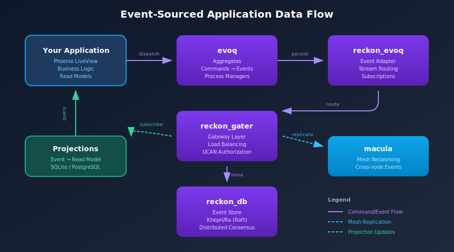

# Macula Ecosystem

  

  <strong>Documentation hub for the Macula distributed application platform</strong>

---

## What is Macula?

Macula is a **BEAM-native platform** for building distributed, event-sourced applications that run on a decentralized mesh network. The ecosystem combines:

- **Event Sourcing** - Capture every state change as an immutable event
- **Mesh Networking** - HTTP/3 over QUIC for NAT-friendly communication
- **Edge Computing** - Run workloads autonomously at the edge
- **Neuroevolution** - Evolve adaptive neural network controllers

## Architecture Overview

  

## Mesh Architecture

  

Edge nodes form clusters that participate in a realm (mesh). Services advertise to the Kademlia DHT, consumers discover them, and communication happens via RPC (request/response) or PubSub (broadcast). All interactions are secured with DID identities and UCAN capability tokens.

## Two Organizations, One Platform

The ecosystem spans two GitHub organizations with complementary responsibilities:

### Infrastructure Layer ([reckon-db-org](https://github.com/reckon-db-org))

Event sourcing and persistence infrastructure:

| Package | Description | Links |
|---------|-------------|-------|
| **reckon_db** | BEAM-native event store built on Khepri/Ra | [GitHub](https://github.com/reckon-db-org/reckon-db) \| [HexDocs](https://hexdocs.pm/reckon_db) |
| **reckon_gater** | Gateway for distributed event store access | [GitHub](https://github.com/reckon-db-org/reckon-gater) \| [HexDocs](https://hexdocs.pm/reckon_gater) |
| **evoq** | Event sourcing primitives (aggregates, commands, events) | [GitHub](https://github.com/reckon-db-org/evoq) \| [HexDocs](https://hexdocs.pm/evoq) |
| **reckon_evoq** | Adapter connecting Evoq to ReckonDB | [GitHub](https://github.com/reckon-db-org/reckon-evoq) \| [HexDocs](https://hexdocs.pm/reckon_evoq) |

### Application Layer ([macula-io](https://github.com/macula-io))

Distributed application platform and tools:

| Package | Description | Links |
|---------|-------------|-------|
| **macula** | HTTP/3 mesh networking over QUIC | [GitHub](https://github.com/macula-io/macula) \| [HexDocs](https://hexdocs.pm/macula) |
| **macula_tweann** | TWEANN neural network topologies | [GitHub](https://github.com/macula-io/macula-tweann) \| [HexDocs](https://hexdocs.pm/macula_tweann) |
| **macula_neuroevolution** | Neuroevolution framework | [GitHub](https://github.com/macula-io/macula-neuroevolution) \| [HexDocs](https://hexdocs.pm/macula_neuroevolution) |
| **macula_console** | Management console for Macula platform | [GitHub](https://github.com/macula-io/macula-console) |
| **macula_os** | Edge node operating system | [GitHub](https://github.com/macula-io/macula-os) |

## Data Flow

  

## Documentation

- [**Overview**](guides/overview.md) - Introduction to the ecosystem
- [**Architecture**](guides/architecture.md) - How the pieces fit together
- [**Getting Started**](guides/getting-started.md) - Build your first app
- [**Event Sourcing**](guides/event-sourcing.md) - CQRS/ES patterns
- [**Mesh Networking**](guides/mesh-networking.md) - HTTP/3 mesh guide
- [**Neuroevolution**](guides/neuroevolution.md) - TWEANN and NEAT
- [**MaculaOS**](guides/macula-os.md) - Edge deployment

## Why Macula?

### Break Free from Big Tech

Five companies control most cloud infrastructure, creating vendor lock-in and data exploitation. Macula provides **infrastructure you own**:

- **Local data processing** - Your data never leaves your network
- **Open standards** - No proprietary lock-in
- **Compute as an asset** - Run micro-datacenters, participate in the mesh economy

### Data Sovereignty by Design

Governments worldwide enforce strict data residency requirements (GDPR, CCPA, localization laws). Macula's edge-first architecture naturally complies:

- **Processing where data is created** - No cross-border transfers
- **Cryptographic authorization** - UCAN tokens, not central auth servers
- **Audit trails** - Event sourcing captures every state change

### Digital Resilience

Centralized systems fail catastrophically. Macula's mesh architecture ensures continuity:

- **If node A fails, nodes B, C, D continue** - No single point of failure
- **Offline-capable** - Nodes operate independently when disconnected
- **Eventual consistency** - Changes propagate when connectivity returns

### Environmental Efficiency

Data centers consume significant global electricity while operating at only 15-25% utilization. Edge processing changes this:

- **10x energy reduction** for local processing vs cloud round-trips
- **Utilize existing hardware** - Any device can join the mesh
- **Reduce network overhead** - Process data where it's generated

### BEAM-Native Excellence

Every component is built on the BEAM (Erlang VM), battle-tested in telecom for 40+ years:

- **Fault tolerance** - Supervisors restart failed processes automatically
- **Soft real-time** - Predictable latency characteristics
- **Hot code loading** - Deploy without downtime
- **Massive concurrency** - Millions of lightweight processes

## Use Cases

- **IoT Platforms** - Collect and process sensor data at the edge
- **Financial Systems** - Complete audit trails with event sourcing
- **Gaming** - Real-time multiplayer on a mesh network
- **Robotics** - Evolve controllers with neuroevolution
- **Healthcare** - Decentralized patient data with UCAN authorization

## Community

- **GitHub**: [macula-io](https://github.com/macula-io) | [reckon-db-org](https://github.com/reckon-db-org)
- **Hex.pm**: Search for `macula` or `reckon`
- **Issues**: Report bugs on the respective repositories

## License

Apache 2.0 - See [LICENSE](LICENSE) for details.

---

  Built with the BEAM

