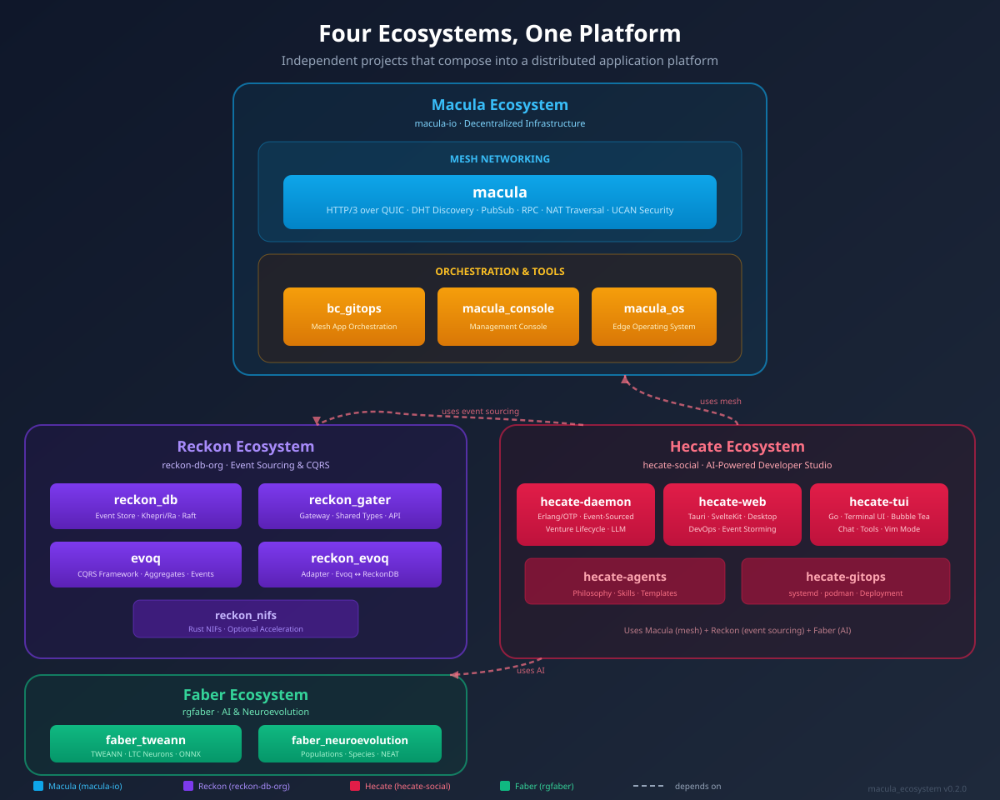
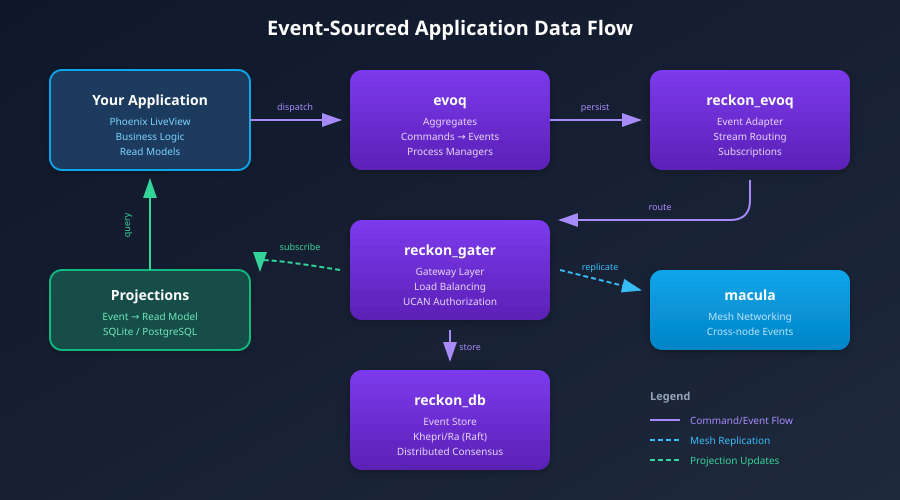

# Macula Ecosystem

  

  <strong>Documentation hub for the Macula distributed application platform</strong>

---

## What is Macula?

Macula is a **BEAM-native platform** for building distributed applications that run on a decentralized mesh network. The ecosystem provides:

- **Mesh Networking** - HTTP/3 over QUIC for NAT-friendly communication
- **Edge Computing** - Run workloads autonomously at the edge
- **Content Transfer** - P2P artifact distribution without external dependencies
- **GitOps Orchestration** - Deploy and manage OTP applications across the mesh

## Architecture Overview

  

## Mesh Architecture

  

Edge nodes form clusters that participate in a realm (mesh). Services advertise to the Kademlia DHT, consumers discover them, and communication happens via RPC (request/response) or PubSub (broadcast). All interactions are secured with DID identities and UCAN capability tokens.

## The Ecosystem

The Macula platform comprises the following components:

---

### Macula Mesh — Decentralized Infrastructure

A BEAM-native HTTP/3 mesh network for edge computing.

| Package | Description | Links |
|---------|-------------|-------|
| **macula** | HTTP/3 mesh networking over QUIC with DHT-based service discovery | [GitHub](https://github.com/macula-io/macula) \| [HexDocs](https://hexdocs.pm/macula) |
| **hecate** | User-facing runtime + extensible app platform for Macula | [GitHub](https://github.com/hecate-social) |
| **hecate-install** | Immutable edge node OS (NixOS-based, replaces archived `macula-os` / `macula-os-nix`) | [GitHub](https://github.com/hecate-social/hecate-install) |

**Core capabilities:**
- **DHT PubSub** — Decentralized publish/subscribe via Kademlia DHT
- **DHT RPC** — Request/response patterns with service discovery
- **NAT Traversal** — HTTP/3 over QUIC for firewall-friendly communication
- **Capability Security** — DID identities with UCAN authorization tokens

---

### bc_gitops — Mesh Application Orchestration ([beam-campus](https://github.com/beam-campus))

BEAM-native GitOps reconciler for publishing, installing, and managing OTP applications across the mesh.

| Package | Description | Links |
|---------|-------------|-------|
| **bc_gitops** | GitOps reconciler for OTP applications | [GitHub](https://github.com/beam-campus/bc-gitops) \| [HexDocs](https://hexdocs.pm/bc_gitops) |

**Core capabilities:**
- **GitOps Reconciliation** — Watches a Git repository for application specifications
- **Auto-deployment** — Automatically deploys, upgrades, and removes applications based on config changes
- **Hot Code Reload** — Supports hot code upgrades for same-version changes
- **Dependency Management** — Respects application dependencies during deployment
- **Multi-format Config** — Supports Erlang terms, YAML, and JSON config files
- **Pluggable Runtime** — Custom deployment strategies via runtime behaviour
- **Mesh Source Type** — Fetch releases from mesh via MCID (Macula Content Identifier)

---

### Macula Content Transfer — P2P Artifact Distribution

  

BEAM-native content-addressed storage and transfer system for distributing OTP releases and artifacts across the mesh without external dependencies like IPFS or BitTorrent.

**Core capabilities:**
- **Content-Addressed Storage** — MCID (Macula Content Identifier) ensures same content = same ID everywhere
- **Merkle Tree Verification** — Chunk-level integrity verification with parallel download
- **Want/Have/Block Protocol** — Efficient P2P exchange inspired by IPFS Bitswap
- **DHT Integration** — Announce availability and discover providers via Kademlia DHT
- **Parallel Download** — Fetch chunks from multiple providers simultaneously
- **NAT-Friendly** — Uses existing Macula QUIC transport (no new NAT traversal needed)

**Protocol message types:** `content_want`, `content_have`, `content_block`, `content_manifest_req`, `content_manifest_res`, `content_cancel`

See the [Content Transfer Guide](guides/content-transfer.md) for API usage and protocol details.

## Data Flow

  

## Documentation

- [**Overview**](guides/overview.md) - Introduction to the ecosystem
- [**Architecture**](guides/architecture.md) - How the pieces fit together
- [**Getting Started**](guides/getting-started.md) - Build your first app
- [**Event Sourcing**](guides/event-sourcing.md) - CQRS/ES patterns
- [**Mesh Networking**](guides/mesh-networking.md) - HTTP/3 mesh guide
- [**Content Transfer**](guides/content-transfer.md) - P2P artifact distribution
- [**Neuroevolution**](guides/neuroevolution.md) - TWEANN and NEAT (moved to Faber ecosystem)
- [**MaculaOS**](guides/macula-os.md) - Edge deployment

## Related Ecosystems

Macula works alongside two independent ecosystems, each maintained by their own organizations:

### Reckon — Event Sourcing & CQRS ([reckon-db-org](https://github.com/reckon-db-org))

A BEAM-native event sourcing stack providing durable event stores, CQRS frameworks, and distributed persistence. Applications built on Macula can use Reckon for event-sourced state management.

| Package | Description | Links |
|---------|-------------|-------|
| **reckon_db** | Distributed event store on Khepri/Ra | [GitHub](https://github.com/reckon-db-org/reckon-db) \| [HexDocs](https://hexdocs.pm/reckon_db) |
| **evoq** | CQRS/ES framework (aggregates, commands, events) | [GitHub](https://github.com/reckon-db-org/evoq) \| [HexDocs](https://hexdocs.pm/evoq) |
| **reckon_gater** | Gateway and shared types | [GitHub](https://github.com/reckon-db-org/reckon-gater) \| [HexDocs](https://hexdocs.pm/reckon_gater) |
| **reckon_evoq** | Adapter connecting evoq to ReckonDB | [GitHub](https://github.com/reckon-db-org/reckon-evoq) \| [HexDocs](https://hexdocs.pm/reckon_evoq) |

> See [reckon-ecosystem](https://github.com/reckon-db-org/reckon-ecosystem) for full documentation.

### Hecate — AI-Powered Developer Studio ([hecate-social](https://github.com/hecate-social))

An AI-powered developer studio for building applications on the Macula mesh. Hecate uses both Macula (for mesh networking) and Reckon (for event sourcing) to provide a venture lifecycle management system.

| Component | Description | Links |
|-----------|-------------|-------|
| **hecate-daemon** | Erlang/OTP backend with venture lifecycle and LLM providers | [GitHub](https://github.com/hecate-social/hecate-daemon) |
| **hecate-web** | Native desktop UI with Tauri/SvelteKit (DevOps, LLM, Event Storming) | [GitHub](https://github.com/hecate-social/hecate-web) |
| **hecate-tui** | Go terminal UI with chat, tools, and vim mode | [GitHub](https://github.com/hecate-social/hecate-tui) |
| **hecate-agents** | Philosophy, skills, and code generation templates | [GitHub](https://github.com/hecate-social/hecate-agents) |

> See [hecate-ecosystem](https://github.com/hecate-social/hecate-ecosystem) for full documentation.

### Faber — AI & Neuroevolution ([rgfaber](https://github.com/rgfaber))

Evolutionary neural network framework for Erlang/OTP. Evolve adaptive AI controllers using TWEANN and NEAT, with optional distributed evaluation across the Macula mesh.

| Package | Description | Links |
|---------|-------------|-------|
| **faber_tweann** | TWEANN neural networks with LTC neurons and ONNX export | [GitHub](https://github.com/rgfaber/faber-tweann) \| [HexDocs](https://hexdocs.pm/faber_tweann) |
| **faber_neuroevolution** | Population-based evolutionary training with speciation and selection | [GitHub](https://github.com/rgfaber/faber-neuroevolution) \| [HexDocs](https://hexdocs.pm/faber_neuroevolution) |

> See [faber-ecosystem](https://github.com/rgfaber/faber-ecosystem) for full documentation.

---

## Why Macula?

### Reclaim Your Place in the AI Economy

AI is rapidly automating cognitive work, displacing millions from traditional employment. But AI needs compute—and that's an opportunity. Macula transforms you from a **displaced worker** into an **infrastructure provider**:

- **Compute as a new asset class** - Your hardware becomes income-generating infrastructure
- **Run micro-datacenters** - Participate in the mesh economy from your home or office
- **Own your contribution** - No middleman taking 30%+ of your compute value
- **Community-owned AI** - Train and run models on community infrastructure, not Big Tech clouds

### A Platform for Indies and Solo Developers

Big Tech platforms demand 30% cuts, dictate your terms, and can deplatform you overnight. Macula puts a **production-ready distributed platform at your fingertips**:

- **Zero platform fees** - Keep 100% of what you earn
- **No app store gatekeepers** - Deploy directly to your users
- **Built-in distribution** - Your app runs on the mesh, scales with demand
- **Own your relationship** - Direct connection to users, no algorithm deciding your fate

### Break Free from Big Tech

Five companies control most cloud infrastructure, creating vendor lock-in and data exploitation. Macula provides **infrastructure you own**:

- **Local data processing** - Your data never leaves your network
- **Open standards** - No proprietary lock-in, no platform risk
- **Portable workloads** - Move freely between nodes and providers

### Data Sovereignty by Design

Governments worldwide enforce strict data residency requirements (GDPR, CCPA, localization laws). Macula's edge-first architecture naturally complies:

- **Processing where data is created** - No cross-border transfers
- **Cryptographic authorization** - UCAN tokens, not central auth servers
- **Audit trails** - Event sourcing captures every state change

### Digital Resilience

Centralized systems fail catastrophically. Macula's mesh architecture ensures continuity:

- **If node A fails, nodes B, C, D continue** - No single point of failure
- **Offline-capable** - Nodes operate independently when disconnected
- **Eventual consistency** - Changes propagate when connectivity returns

### Environmental Efficiency

Data centers consume significant global electricity while operating at only 15-25% utilization. Edge processing changes this:

- **10x energy reduction** for local processing vs cloud round-trips
- **Utilize existing hardware** - Any device can join the mesh
- **Reduce network overhead** - Process data where it's generated

### BEAM-Native Excellence

Every component is built on the BEAM (Erlang VM), battle-tested in telecom for 40+ years:

- **Fault tolerance** - Supervisors restart failed processes automatically
- **Soft real-time** - Predictable latency characteristics
- **Hot code loading** - Deploy without downtime
- **Massive concurrency** - Millions of lightweight processes

## Use Cases

- **IoT Platforms** - Collect and process sensor data at the edge
- **Financial Systems** - Complete audit trails with event sourcing
- **Gaming** - Real-time multiplayer on a mesh network
- **Robotics** - Evolve controllers with [Faber](https://github.com/rgfaber/faber-ecosystem) neuroevolution
- **Healthcare** - Decentralized patient data with UCAN authorization

## Community

- **Macula**: [macula-io](https://github.com/macula-io) on GitHub | Search `macula` on [hex.pm](https://hex.pm)
- **Reckon**: [reckon-db-org](https://github.com/reckon-db-org) on GitHub | Search `reckon` on [hex.pm](https://hex.pm)
- **Hecate**: [hecate-social](https://github.com/hecate-social) on GitHub
- **Faber**: [rgfaber](https://github.com/rgfaber) on GitHub | Search `faber` on [hex.pm](https://hex.pm)
- **beam-campus**: [beam-campus](https://github.com/beam-campus) on GitHub | `bc_gitops` on [hex.pm](https://hex.pm)
- **Issues**: Report bugs on the respective repositories

## License

Apache 2.0 - See [LICENSE](LICENSE) for details.

---

  Built with the BEAM

