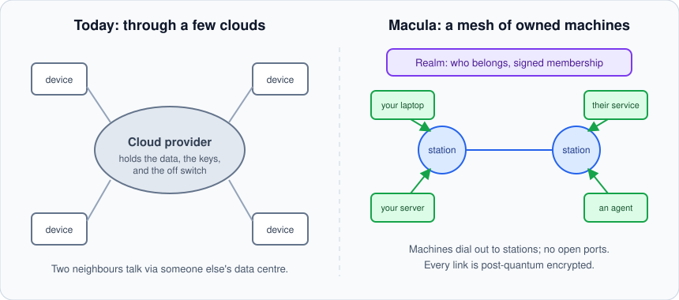
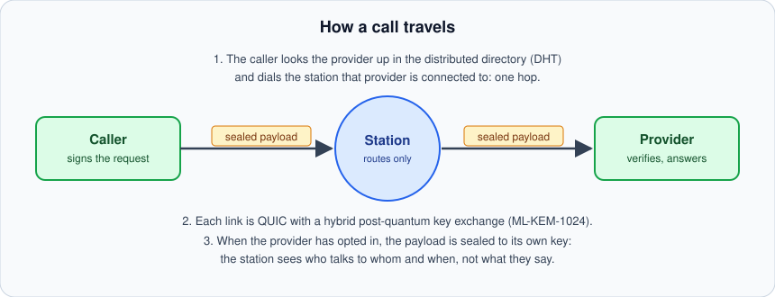
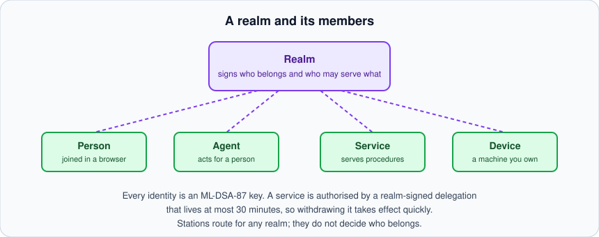
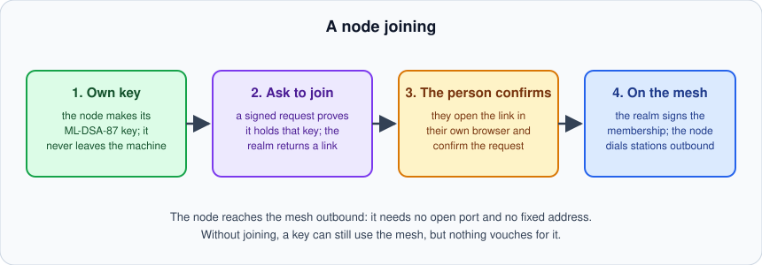

# Macula

  

Macula is a mesh: machines that people and organisations own, connected directly to each other, with no cloud in the
middle. This page explains what it is, why it is a different way to use the internet, and what is built today.

## The problem

Most of what we do online travels through a handful of cloud providers. Two neighbours sending each other a message,
a sensor reporting to a server in the next room, two companies exchanging an order: the traffic goes up to someone
else's data centre and back down. That provider holds the data and the keys, sets the terms and the prices, and can
switch any of it off. The machines at either end, which the people involved actually own, do none of the work of
connecting.

## The idea

  

Macula lets those owned machines talk to each other directly, as a mesh. Four ideas carry it:

- **Owned machines.** A laptop, a server in a cupboard, a service in a container: each one holds its own identity, a
  key it generates and keeps. Nothing about it is rented from a platform.
- **Stations that route.** Machines connect *outbound* to stations, so nothing needs an open port, a fixed address or a
  VPN. Stations keep a shared directory (a distributed hash table) of who offers what, and forward traffic between
  machines. They route; they do not own anything.
- **A realm for identity.** A realm says who belongs: which people, agents, services and devices are members, and which
  service may offer what. Membership is signed, so any machine can check it without asking a central server; a membership checked that way
  holds until it expires (up to 30 days), so revoking a member stops new ones, not one already issued.
- **Sealing end to end.** Every link is encrypted. On top of that, a call can be sealed to the receiving service's own
  key, so the station that forwards it sees who is talking to whom, but not what they say.

## How a call travels

  

A program that wants something done (the caller) looks up who offers it (the provider) in the shared directory, then
sends its request to the station that provider is connected to: one hop. The caller signs the request, the provider
checks the signature and answers, and no station in between can change either message without being detected.

## A realm and its members

  

A realm vouches for its members. A person joins through their own browser; an agent acts on that person's behalf; a
service is allowed to offer what it offers by a realm-signed delegation that lives at most 30 minutes, so when the
realm withdraws it, it stops working quickly. Stations serve any realm, and one station can serve several.

## Joining

  

A machine makes its own key, asks the realm to join and proves it holds that key, and the person confirms the request in
their own browser. The realm then signs the membership, and the machine dials stations outbound. The details are in [guides/joining-a-realm.md](guides/joining-a-realm.md).

## What it makes possible

- **Services without a platform in between.** A service on your own hardware is reachable by the realm's members
  wherever they are, without a hosting contract or an open port.
- **Data without a platform holding it.** Data travels between the machines involved, through stations that forward
  it, instead of being stored by a platform in order to be shared.
- **Agents that work together.** Programs and AI agents find each other's services and call them, under an identity the
  realm signed.
- **Trust you can check.** Who belongs, who may serve what, and what was sent are all signed, so each machine verifies
  them itself.

## Security today

Macula's security is recorded feature by feature in a register, with the evidence behind each claim and how far it is
built. The public edition is **[SECURITY_FEATURES.md](SECURITY_FEATURES.md)**. In short:

- Every mesh link uses TLS 1.3 with a hybrid post-quantum (ML-KEM) key exchange, and stations refuse classical-only
  clients.
- Every node, token and proof is signed with ML-DSA-87, a post-quantum signature.
- Every request, reply and event is signed by its sender and verified by the receiver, so no station can alter it
  undetected.
- Sealing end to end is on for five services so far, two of which accept nothing else; for the others, the stations
  can still read what they relay.
- Stations see who talks to whom and when; Macula claims no anonymity.
- Identity keys are protected by file permissions only, and there is no revocation list for a stolen key yet.

## Where to start

Macula runs today on a development fleet. The building blocks are open source under Apache-2.0:

| You want to | Look at |
|---|---|
| Build on the mesh from Erlang or Elixir | [macula](https://github.com/macula-io/macula) |
| Build from Go, Rust, Python, .NET, TypeScript or PHP | [macula-go](https://github.com/macula-io/macula-go), [macula-rust](https://github.com/macula-io/macula-rust), [macula-py](https://github.com/macula-io/macula-py), [macula-dotnet](https://github.com/macula-io/macula-dotnet), [macula-ts](https://github.com/macula-io/macula-ts), [macula-php](https://github.com/macula-io/macula-php) |
| Try the mesh from a terminal | [macula-cli](https://github.com/macula-io/macula-cli) |
| Give an AI agent access to the mesh | [macula-mcp](https://github.com/macula-io/macula-mcp) |
| Read the post-quantum building blocks | [macula-pqc](https://github.com/macula-io/macula-pqc) |

The station and the realm are developed separately; the station image is publicly available.

## Reporting a vulnerability

See [SECURITY.md](SECURITY.md).

## License

Apache 2.0. See [LICENSE](LICENSE).
