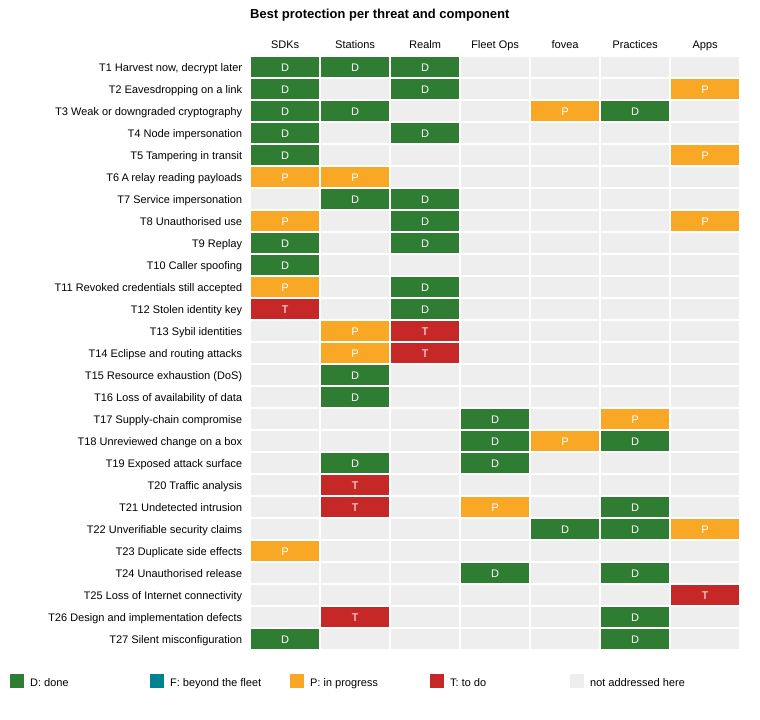
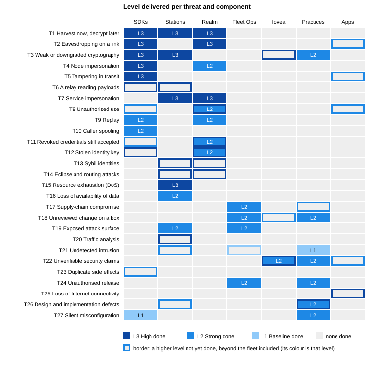
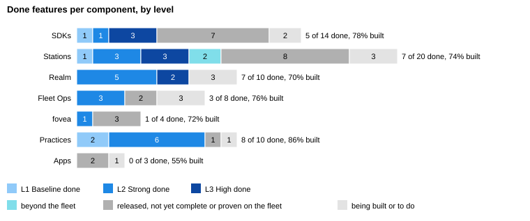

# Macula cybersecurity features: state and security level

<!-- register_sha: d07751b81dfffc6bd20feffe1c593041646cd19f -->

> Generated from the Macula security register at commit `d07751b`, as of 2026-10-08. A live check at 2026-10-08T13:44:15Z found all 24 rows with conditions holding. Do not edit this file: it is replaced from the register.

> **TLP:CLEAR.** This edition may be shared freely. Fleet-specific details and internal evidence are left out; the full register is available to partners under a non-disclosure agreement.

<!-- GENERATED from security/features.yaml by security/build_register.py. Do not edit by hand. -->

This is a register of the security features across the Macula ecosystem: the SDKs, the relay stations, the realm, the fleet that runs them, the independent observer mcl-fovea, and the engineering practices behind all of it. It is correct as of 8 October 2026. For each feature it gives what the feature does, the evidence, how far it is built, the level of protection it aims for, and the threats it protects against. It covers the platform: the mesh, the realm and the fleet. Properties of one application, such as a video service withdrawing a clip, are assessed in that service's own security grid (its fovea assessment), not here.

Security findings that harden the system are filed as public issues, in defensive terms. Anything exploitable on the running fleet stays private until it is fixed. A public advisory for each fixed vulnerability is the intended practice but not yet in place; it is an open row under Practices. This register puts open weaknesses and fleet specifics side by side, which is why its full edition is shared only under a non-disclosure agreement.

It is a status register, not a certification. Nothing here states that Macula meets, complies with or is certified against any standard. Where a standard is named, it names the algorithm list or requirement the feature is designed against. A feature counts as **done** only when it is released and, where it touches the wire, measured on the running fleet.

## At a glance

The register lists 69 features: 31 done, 2 beyond the fleet, 26 in progress and 10 to do.

**Strengths**

- **Post-quantum by default on every link.** Every mesh link uses TLS 1.3 with a hybrid ML-KEM key exchange, stations refuse classical-only clients, and every link type has been measured.
- **Post-quantum identities.** Every node, token and proof is signed with ML-DSA-87 (NIST category 5), optionally combined with RSA-PSS-4096.
- **Tamper-evident end to end.** Every request, reply and event is signed by its sender and verified by the receiver, so no relay can alter it undetected.
- **Authorisation you can revoke quickly.** Services are authorised by realm-signed delegations that live at most 30 minutes; proofs are bound to what they authorise and refuse replay.
- **A disciplined supply chain.** Every box reconciles from a reviewed repository and checks each image's signature, SBOM and provenance by digest before it runs; the public station boxes refuse one that fails. Releases are approved per commit range, reviewed adversarially and tested first.

**Gaps**

- **Payload sealing is on for five services only.** Sealed calls and a sealed stream are measured on the fleet, and two services accept nothing else, but stations can still read what they relay to every provider that has not opted in.
- **Traffic analysis.** Stations see who talks to whom and when; no anonymity is claimed.
- **Keys at rest and key compromise.** Identity keys are protected by file permissions only, and there is no revocation list for a stolen key yet.
- **Eclipse resistance and closed membership.** Eclipse-resistance diversity has code but no data yet, and invite-only realms are not built.
- **Security operations.** The tamper-evident security audit log and a repeatable DoS test campaign are still owed. First bounded DoS probes ran on 4 October 2026; their findings are filed as issues and the fixes are under review. The vulnerability disclosure policy is published in every repository, but no report has tested it.

Threats with no done protection yet (Appendix A): T6 (A relay reading payloads), T13 (Sybil identities), T14 (Eclipse and routing attacks), T20 (Traffic analysis), T23 (Duplicate side effects), T25 (Loss of Internet connectivity).

{width=100%}

A feature's security level is what it aims at; the two charts below count only what is delivered, the features that are done.

{width=100%}

{width=100%}

## How to read the tables

**State**

- **Done**: released, and deployed or measured where that applies.
- **Beyond the fleet**: released and on the fleet, but some properties only occur at a scale the fleet does not have. They are proven in a test harness at that scale, released, observed on the fleet as not triggered, and listed as such, never as done; the charts count them as not done. Today: Idle-connection bound; DHT correct beyond 20 stations.
- **In progress (n%)**: part of the planned work is released or built. The percentage is an estimate: the share of the feature's planned work packages that are complete, confirmed at every release by the register's owner with the people doing the work. The bar chart separates those whose software is already released, but not yet complete or proven on the fleet, from those still being built; its share built weighs each feature by this percentage.
- **To do**: designed or listed, not built.

**Security level**

The levels are modelled on the IEC 62443 attacker scale: each names the attacker a feature is designed to withstand. IEC 62443 targets industrial control systems; the register borrows only its attacker scale, and claims no IEC 62443 security level for Macula. A feature's level is what it aims for and its state says how far that is delivered, as the standard separates a target level from an achieved one.

- **L1 Baseline**: standard good practice for a networked service: designed to withstand casual or coincidental violation and simple intentional attacks (the attacker of IEC 62443 levels 1 and 2).
- **L2 Strong**: designed to withstand an intentional attacker with sophisticated means, moderate resources and system-specific skills (the attacker of IEC 62443 level 3).
- **L3 High**: designed to withstand an attacker with sophisticated means, extended resources and high motivation (the attacker of IEC 62443 level 4). Also designed against the algorithm and strength sets of NSA CNSA 2.0 and BSI TR-02102, or against a control a military CIS accreditation typically examines. For post-quantum algorithms, the NIST security category is given (category 5 is the highest).

**Evidence**

Where evidence is public, the feature links it: a release, an issue or a document. Further evidence, including measurements, is available to partners under a non-disclosure agreement. Each section lists the public evidence under its table, feature by feature.

**Threats**

The Threats column refers to the threat catalogue in Appendix A (T1 to T27): the threats each feature protects against. Appendix B maps the features to the frameworks procurement uses.

## 1. SDKs: cryptography and identity in every node

The SDKs are the libraries every Macula program links: Erlang (the reference), Go, Rust, TypeScript, Python, .NET and PHP, plus the command-line tool and the MCP server built on them.

| Feature | What it does | State | Level | Threats |
|------------------|------------------------------------------------------|-----------|--------|---------|
| Post-quantum key exchange | Every mesh link is QUIC with TLS 1.3 and a hybrid post-quantum key exchange, and every client settles on SecP384r1MLKEM1024 (ML-KEM-1024, NIST category 5). BEAM nodes and stations select it; Go-based clients do since macula-go 0.23.0, which offers it alone and refuses a handshake that settles on any other group (earlier releases land on SecP256r1MLKEM768, category 3), and the Python, .NET, PHP and TypeScript SDKs, the command-line tool and the MCP server are released on that version; the Rust SDK offers it alone since macula-rust 0.8.0, so a handshake that would settle on any other group fails (0.7.0 also offered SecP256r1MLKEM768, macula-rust#18). Measured on every link type, and for the Go, Python, .NET and PHP clients against a live station on 6 October 2026. | Done | L3 High | T1, T2, T3 |
| Post-quantum identities and signatures | Every node has a signing identity: ML-DSA-87 (category 5) in the `pq_pure` profile, or the IETF LAMPS composite of ML-DSA-87 and RSA-PSS-4096 in the `pq_hybrid` profile. The node id is derived from that key. ML-DSA is checked against NIST's ACVP vectors. The composite follows the LAMPS format since macula 12.0.0, a deliberate break: a `pq_hybrid` signature made by an earlier version does not verify, nor the reverse (`pq_pure` signatures are unchanged, though 12.0.0 breaks the wire for both profiles), and capability tokens moved from Ed25519 to ML-DSA in the same release. Signatures stored before it are not accepted and are issued again: device membership tokens on request (a pre-12 token is refused as EdDSA whatever its expiry; the realm's 30-day cap puts the last one minted before the 23 September roll past expiry by 23 October 2026), realm member endorsements by the realm's renewal sweep, whose first run on 28 September 2026 renewed the one pre-12 record among live members; after it every live member's stored endorsement verified. | Done | L3 High | T4, T5 |
| Signed frames, verified end to end | Requests, replies and events are signed by their sender and verified by the receiving SDK, so no station on the path can alter them undetected. | Done | L3 High | T4, T5 |
| Neighbour channel binding | Released in the Erlang SDK (macula 13.2.0, handshake v5) the Go SDK (macula-go 0.20.0), the Python SDK (macula-py 0.4.0) and the .NET SDK (Macula 0.7.0), each tested against the Erlang SDK in both directions and both profiles; the Rust SDK (macula-rust 0.6.0) dials v5 on every link, held to the Erlang SDK's own v5 frames and to macula#53's interleavings; the TypeScript SDK (@macula-io/ts 0.27.1) and the PHP SDK (macula-php 0.7.0) carry it through the same library, not yet tested against Erlang on v5 (PHP is tested against macula-go's test stations). On the fleet since 29 September 2026 (station 0.7.1 and later); all six stations run station 0.8.0, on macula 14, since 7 October 2026, each signing that version in its endpoint record. Not yet measured there. In v5, hop-only control frames no longer carry a composite signature each: each connection is authenticated once instead, by composite proofs bound to that TLS 1.3 connection, and every frame after that is authenticated by QUIC's encryption under the hybrid key exchange. What stays: if ML-DSA-87 were broken, a node still accepts control frames only from its authenticated neighbour. No end-to-end signature is removed. A client falls back to the older handshake once, only when a station does not know v5. Limits: an attacker able to break ML-DSA can hold a peer's connections to a node on the older handshake until that peer completes one new handshake with it, and macula 13.2.1 closes a gap where two interleaved connections could leave one on the older handshake (macula#53); the older handshake keeps its per-frame signatures, so the cost is CPU, not authenticity; a station's first v5 release becomes its rollback floor; the start-up check proves the configured key-exchange posture, not each connection's negotiated group. | In progress (70%) | L3 High | T4, T5 |
| Payload sealing for calls and streams | The caller seals a payload to the provider's own key, taken from its signed advertisement (ML-KEM and AES-256-GCM), and the provider seals its answer; a sealed call never falls back to the clear. Released in all seven SDKs (Erlang, Go, TypeScript, Python, .NET, PHP and Rust), tested across SDKs, and off by default in each; a caller's seal report says whether an exchange was sealed and to which key. Measured on the live network: five services seal, and calls to them through the stations came back sealed to the provider's key; two of them, the video service and the work board, accept nothing else, and the video service refused a clear connection 23 seconds after it started. Every other service still serves in the clear, so a station can read what it relays to them. A station always sees who calls whom, the procedure, the time and the size. | In progress (95%) | L3 High | T2, T6 |
| Sealed publish/subscribe | A group's events are sealed once under the group's current key; keys rotate every 15 minutes and are handed out by the owning organisation's distributor, over sealed calls, only to a caller with the organisation's grant and a live realm membership, read at each pull from the realm-signed endorsement in the caller's slot over a lookup: a member whose membership ended is refused once the realm's tombstone reaches the distributor, and a station on the lookup path could withhold it, leaving the old endorsement good until its own expiry. Released in the Erlang SDK (macula 13.2.0), with test vectors published for the other SDKs; none reads the group-key vectors yet, and the Go SDK checks only its per-publisher event key against the event vectors, with no sealed publish/subscribe at run time; off on the fleet, since a distributor advertises only under the kem_advertise switch sealed calls need, which no distributor on the fleet sets; not measured. | In progress (40%) | L3 High | T2, T6 |
| Capability tokens (UCAN) | Delegable, post-quantum-signed capability tokens gate who may call a procedure. Released in Erlang, Go (macula-go 0.17.0; since 0.25.0 a chain with any link expiring more than 10 years out authorizes nothing, macula#68), Python (macula-py 0.3.0) and .NET (Macula 0.6.0), and matched against shared test cases; PHP (macula-php 0.8.0) presents and gates on them through the Go library, tested between PHP nodes only. TypeScript (@macula-io/ts 0.29.0) mints, presents and gates on them through the same library, tested against in-process stations: for calls, no token, a token for another node and one from another root refused before the handler runs, and a direct grant and a one-level delegation served; for a stream, only the refusal without a token and a granted open are tested. The MCP server (@macula-io/mcp 0.42.0) presents one when a call asks (`ucan: 1`); on 6 October 2026, through the live fleet, it was refused without a token and with a foreign one and served with the gate root's token, by a provider admitted for the test and then revoked. A realm-membership gate (realm_member_required) serves a person's client carrying a note rooted at that person's realm membership (macula-cli 0.14.0, @macula-io/mcp through MACULA_MCP_UCAN), measured on the live fleet on 6 October 2026 by a second provider admitted for the test and then revoked. Rust (macula-rust 0.9.0) mints, presents and gates on them for calls and stream opens, held to the shared test cases in both profiles; the 12 tokens it mints reach the Erlang SDK's own verdict (scripts/interop/ucan.sh), and a did:key longer than any node key's is refused before it is decoded; tested against in-process stations, not on the live fleet. Limit: the Erlang SDK decodes a token's did:key, in time quadratic in its length, before checking the signature, so a caller chooses that CPU cost; the scheduler preempts it, so it holds no worker (macula#87). | In progress (95%) | L2 Strong | T8, T11 |
| Proofs bound to what they authorise | The ownership proof (v2) and the realm-join device proof (v2) sign the realm, the request fields, a domain tag and a nonce, and refuse replays and tampering. Signers exist in Erlang, Go, Python, .NET, TypeScript, the CLI and the MCP server, and each is checked against the Erlang verifier. | Done | L2 Strong | T9, T10, T4 |
| Verified caller identity | A handler sees only the caller identity the transport verified; a caller-written `caller` field is stripped. Released in macula 12.11.1 (26 September 2026), in Go since macula-go 0.17.0, in .NET since Macula 0.6.0 and in Rust since macula-rust 0.8.0 (macula-rust#13). On the fleet, read in the containers on 7 October 2026 after the evening rolls, all 13 running mcl-* services are on macula 14.2.1; mcl-bookclub-phoenix, the last on macula 12, is retired. | In progress (95%) | L2 Strong | T10, T8 |
| At most one delivery per call | Once a call has left, the SDK returns its outcome and does not resend it elsewhere, so a handler never runs twice and a single-use proof is never replayed by the SDK. A call whose reply is lost ends in a timeout error and is not retried: the handler ran once or not at all, and the caller cannot tell which, so retrying is the application's decision and a retry is a new request. The Erlang SDK works this way, the Go SDK since macula-go 0.18.1, the Rust SDK since macula-rust 0.5.1, and the TypeScript, Python and .NET SDKs since @macula-io/ts 0.24.1, macula-py 0.3.1 and Macula 0.6.1, which ship macula-go 0.18.2's shared library (the property is 0.18.1's pool fix; 0.18.2 adds that nothing goes out past the caller's deadline), and the PHP SDK since macula-php 0.7.0, which ships macula-go 0.22.0's. Before those, a handler slower than its share of the deadline ran twice. | In progress (95%) | L2 Strong | T23, T9 |
| Loud failures | Refused options and invalid settings fail with a named error instead of being silently ignored (for example, disabling sealing on a call to a keyed provider). | Done | L1 Baseline | T27 |
| Identity keys protected at rest | Identity keys are files with owner-only permissions, and the Erlang, Go and TypeScript SDKs refuse to load one that its group or others can read. The Rust SDK does on Unix; on Windows, since macula-rust 0.8.0, it keeps a node key only in the user's Credential Manager, on that machine, and refuses a key file there (macula-rust#19). Every Rust key store keeps only the private part. Planned: encrypted at rest (step 1), then held in a TPM or HSM (step 2). | To do | L3 High | T12 |
| Pure ML-KEM-1024 profile | A non-hybrid key exchange for a profile that requires it (CNSA 2.0 does not require hybrids). Low priority for a European deployment. | To do | L3 High | T1, T3 |
| Content identifiers on SHA-384 | Content ids move from BLAKE3, which the government guidance does not list, to SHA-384. The Erlang, Go and Rust SDKs mint and accept only SHA-384 content ids. mcl-tube mints and serves only SHA-384 ids and refuses a legacy BLAKE3 id since 0.2.0; on the fleet on 6 October 2026 it re-hashed its stored legacy content once (7 files, none failed, none left). The SDK's unused BLAKE3 code is gone since macula 14.0.0 (6 October 2026). | In progress (95%) | L2 Strong | T3, T5 |

**Evidence, section 1**

- **Post-quantum key exchange**
    - [macula-go#20: Go clients settle on SecP384r1MLKEM1024](https://github.com/macula-io/macula-go/issues/20)
    - [macula-rust 0.8.0 CHANGELOG: SecP384r1MLKEM1024 alone (#18)](https://github.com/macula-io/macula-rust/blob/v0.8.0/CHANGELOG.md)
    - [macula-pqc](https://github.com/macula-io/macula-pqc)
- **Post-quantum identities and signatures**
    - [macula README, Identity and Crypto](https://github.com/macula-io/macula#identity-and-crypto-nif-accelerated)
    - [macula-mldsa](https://crates.io/crates/macula-mldsa)
    - [macula 12.0.0 CHANGELOG: pq_hybrid breaking on the wire](https://github.com/macula-io/macula/blob/v12.0.0/CHANGELOG.md)
- **Signed frames, verified end to end**
    - [macula](https://github.com/macula-io/macula)
- **Neighbour channel binding**
    - [design, accepted (macula a34a6af3), sections 3 to 6](https://github.com/macula-io/macula/blob/a34a6af3/plans/DESIGN_NEIGHBOUR_CHANNEL_BINDING.md)
    - [macula 13.2.0](https://hex.pm/packages/macula/13.2.0)
    - [macula 13.2.0 CHANGELOG: handshake v5 and the rollback floor as observed](https://github.com/macula-io/macula/blob/v13.2.0/CHANGELOG.md)
    - [macula 13.2.1 CHANGELOG: no ordering keeps a v4 connection to a node seen on v5 (macula#53, closed)](https://github.com/macula-io/macula/blob/v13.2.1/CHANGELOG.md)
    - [macula-go 0.20.0: handshake v5 and the macula#53 closure](https://github.com/macula-io/macula-go/releases/tag/v0.20.0)
    - [macula-go 0.20.0: recorded v5 interop with macula 13.2.1, both directions, both profiles](https://github.com/macula-io/macula-go/releases/download/v0.20.0/handshake-v5-interop-v0.20.0.log)
    - [macula-py 0.4.0: sealing, the seal report and handshake v5 (PyPI)](https://pypi.org/project/macula-py/0.4.0/)
    - [macula-py 0.4.0: the recorded interop run against macula 13.2.2, both profiles](https://github.com/macula-io/macula-py/blob/v0.4.0/scripts/interop/README.md)
    - [Macula .NET 0.7.0: the recorded interop run against macula 13.2.2, both profiles](https://github.com/macula-io/macula-dotnet/blob/v0.7.0/scripts/interop/README.md)
    - [@macula-io/ts 0.26.0 CHANGELOG: handshake v5 through macula-go 0.20.0](https://github.com/macula-io/macula-ts/blob/v0.26.0/CHANGELOG.md)
- **Payload sealing for calls and streams**
    - [macula 13.0.0](https://hex.pm/packages/macula/13.0.0)
    - [macula-rust 0.7.0 CHANGELOG: sealing on both sides, the seal report, Erlang interop](https://github.com/macula-io/macula-rust/blob/v0.7.0/CHANGELOG.md)
    - [macula-go 0.18.0](https://pkg.go.dev/github.com/macula-io/macula-go@v0.18.0)
    - [macula-go: off by default, pool.Opts.KEMAdvertise](https://github.com/macula-io/macula-go/blob/286fa66d81bd3810f74cccfc68a8d87f2706ed16/pool/pool.go#L109-L115)
    - [macula-go: off by default, stationlink.Config.KEMAdvertise](https://github.com/macula-io/macula-go/blob/286fa66d81bd3810f74cccfc68a8d87f2706ed16/stationlink/link.go#L97)
    - [macula-go 0.18.0: recorded Erlang<->Go sealed interop run, both directions, both profiles](https://github.com/macula-io/macula-go/releases/download/v0.18.0/sealed-interop-v0.18.0.log)
    - [@macula-io/ts 0.24.0](https://github.com/macula-io/macula-ts/releases/tag/v0.24.0)
    - [@macula-io/ts: off by default, Pool.connect kemAdvertise](https://github.com/macula-io/macula-ts/blob/5bee707e88a40cb1ff96364870cc2549c7e51c1f/src/pool.ts#L181)
    - [@macula-io/ts: the sealing tests, a caller and a provider on two stations in the test harness](https://github.com/macula-io/macula-ts/blob/5bee707e88a40cb1ff96364870cc2549c7e51c1f/src/sealing.test.ts)
    - [@macula-io/ts: CI run at 5bee707, sealing tests green](https://github.com/macula-io/macula-ts/actions/runs/36446051384/job/109008516112)
    - [@macula-io/ts 0.24.0: recorded Erlang<->TypeScript sealed interop run, both directions, both profiles](https://github.com/macula-io/macula-ts/releases/download/v0.24.0/sealed-interop-ts-v0.24.0.log)
    - [macula-go: the interop script with the TypeScript leg (SEALED_PEER=ts)](https://github.com/macula-io/macula-go/blob/0275c75af67644ec6f77782dfe387d1ccd1cc16b/scripts/interop/sealed.sh)
    - [macula-go: the interop script](https://github.com/macula-io/macula-go/blob/286fa66d81bd3810f74cccfc68a8d87f2706ed16/scripts/interop/sealed.sh)
    - [design](https://github.com/macula-io/macula/blob/main/docs/design/DESIGN_E2E_PAYLOAD_CONFIDENTIALITY.md)
    - [test vectors](https://github.com/macula-io/macula/blob/main/test/vectors/E2E_SEAL_V1.md)
    - [caller's seal report: design](https://github.com/macula-io/macula/blob/main/docs/design/DESIGN_E2E_SEAL_REPORT.md)
    - [macula 13.1.0 (the Erlang seal report)](https://hex.pm/packages/macula/13.1.0)
    - [macula-go 0.19.0 (the Go and C ABI seal report)](https://pkg.go.dev/github.com/macula-io/macula-go@v0.19.0)
    - [@macula-io/ts 0.25.0: recorded run, the TypeScript caller's seal report against an Erlang provider, both profiles](https://github.com/macula-io/macula-ts/releases/download/v0.25.0/sealed-interop-ts-report-v0.25.0.log)
    - [macula-go: tssealed asserting the TypeScript call and stream reports](https://github.com/macula-io/macula-go/blob/7b4c888bea5d1a3508fdd13b769c44b0e90726a0/scripts/interop/tssealed/tssealed.mjs)
    - [macula-go 0.19.0: recorded Erlang<->Go interop with the seal reports, both directions, both profiles](https://github.com/macula-io/macula-go/releases/download/v0.19.0/sealed-interop-v0.19.0.log)
    - [macula-py 0.4.0: sealing, the seal report and handshake v5 (PyPI)](https://pypi.org/project/macula-py/0.4.0/)
    - [macula-py 0.4.0: the recorded interop run against macula 13.2.2, both profiles](https://github.com/macula-io/macula-py/blob/v0.4.0/scripts/interop/README.md)
    - [Macula .NET 0.7.0: the recorded interop run against macula 13.2.2, both profiles](https://github.com/macula-io/macula-dotnet/blob/v0.7.0/scripts/interop/README.md)
- **Sealed publish/subscribe**
    - [design, section 6](https://github.com/macula-io/macula/blob/main/docs/design/DESIGN_E2E_PAYLOAD_CONFIDENTIALITY.md)
    - [macula 13.2.0 CHANGELOG: sealed groups](https://github.com/macula-io/macula/blob/v13.2.0/CHANGELOG.md)
- **Capability tokens (UCAN)**
    - [macula-go v0.17.0](https://github.com/macula-io/macula-go/releases/tag/v0.17.0)
    - [UCAN test vectors](https://github.com/macula-io/macula/blob/main/test/vectors/UCAN_V1.md)
    - [@macula-io/ts 0.29.0: UCAN-gated calls, streams and serving](https://github.com/macula-io/macula-ts/blob/v0.29.0/CHANGELOG.md)
    - [@macula-io/mcp 0.42.0: mesh_call presents a UCAN](https://github.com/macula-io/macula-mcp/blob/v0.42.0/CHANGELOG.md)
    - [macula-rust 0.9.0 CHANGELOG: UCAN minted, presented and gated (#12)](https://github.com/macula-io/macula-rust/blob/v0.9.0/CHANGELOG.md)
    - [macula-rust ucan.sh: minted tokens authorized by macula's own macula_ucan](https://github.com/macula-io/macula-rust/blob/v0.9.0/scripts/interop/ucan.sh)
    - [macula#87: a did:key is decoded in quadratic time before the signature check](https://github.com/macula-io/macula/issues/87)
- **Proofs bound to what they authorise**
    - [mcl_om 0.32.1](https://hex.pm/packages/mcl_om/0.32.1)
    - [mcl-om#7](https://github.com/macula-services/mcl-om/issues/7)
- **Verified caller identity**
    - [macula 12.11.1](https://hex.pm/packages/macula/12.11.1)
    - [macula-rust 0.8.0 CHANGELOG: a served handler no longer sees a caller the sender wrote (#13)](https://github.com/macula-io/macula-rust/blob/v0.8.0/CHANGELOG.md)
- **At most one delivery per call**
    - [macula 13.0.1: failure_scope/1, only an unsent call moves on](https://github.com/macula-io/macula/blob/92137b94fbef503e5d0ad2e69a6477a2dd708fe8/src/client/macula_station_link.erl#L659-L666)
    - [macula-go: a slow handler on two candidates is entered once](https://github.com/macula-io/macula-go/blob/afbb4d7c10d468c8c9a52952070048ce9da8f914/pool/once_test.go#L48)
    - [macula-go 0.18.1](https://pkg.go.dev/github.com/macula-io/macula-go@v0.18.1)
    - [macula-go#8](https://github.com/macula-io/macula-go/issues/8)
    - [@macula-io/ts: a slow handler on two providers is entered once](https://github.com/macula-io/macula-ts/blob/5f66794052f9c3cc69fef922c75edad234cd2575/src/pool.test.ts#L81)
    - [@macula-io/ts 0.24.1](https://github.com/macula-io/macula-ts/releases/tag/v0.24.1)
    - [macula-rust: a slow handler on two candidates is entered once](https://github.com/macula-io/macula-rust/blob/a33ddeff170f7e98bd4b7b6df7492e0100eefa53/tests/pool.rs#L587)
    - [macula-rust: the outcome of a sent call is final](https://github.com/macula-io/macula-rust/blob/a33ddeff170f7e98bd4b7b6df7492e0100eefa53/src/pool/call.rs#L338-L360)
    - [macula-rust 0.5.1](https://crates.io/crates/macula-rust/0.5.1)
    - [macula-rust#6](https://github.com/macula-io/macula-rust/issues/6)
    - [macula-py: a call enters one of two slow providers' handlers once](https://github.com/macula-io/macula-py/blob/e5dbb622aca5b1d319f9c773dd117af7d7025081/tests/test_pool.py#L263)
    - [macula-py 0.3.1](https://pypi.org/project/macula-py/0.3.1/)
    - [Macula .NET: a call enters one of two slow providers' handlers once](https://github.com/macula-io/macula-dotnet/blob/a2f64a54ffb6710d721f3931aafc85ff79ef993b/tests/Macula.Tests/PoolTests.cs#L119)
    - [Macula .NET 0.6.1](https://www.nuget.org/packages/Macula/0.6.1)
- **Loud failures**
    - [macula 13.0.1](https://hex.pm/packages/macula/13.0.1)
- **Content identifiers on SHA-384**
    - [macula#46: mcl-tube re-hash and BLAKE3 removal](https://github.com/macula-io/macula/issues/46)

## 2. Relay stations

Stations relay calls, events and streams between nodes and hold the DHT. Six run today. The station repository is private; its releases run on the public fleet.

| Feature | What it does | State | Level | Threats |
|------------------|------------------------------------------------------|-----------|--------|---------|
| Post-quantum only | Stations refuse a classical-only client. Measured on all six stations. | Done | L3 High | T1, T3 |
| AES-256 only | Stations offer TLS_AES_256_GCM_SHA384 alone, and a client offering only AES-128 is refused (measured on all six). QUIC Initial packets stay AES-128-GCM, as RFC 9001 requires. | Done | L3 High | T1, T3 |
| Authorisation at the edge | Every advertisement's realm-signed chain is checked before the station accepts it. | Done | L3 High | T7, T15 |
| Edge admission limits | Stations cap providers per procedure and procedures per advertiser, and count each connection's store bytes against its own 16 MiB bucket, refilled at 1 MiB a second, before verifying, so a client flooding stores exhausts its own budget. On all stations since v0.6.3. Since station 0.7.2 a failed signature on a frame every honest relay verifies is also charged to the peer: 10 in a minute throttle it for 60 seconds, a third throttle in 10 minutes closes its connections, kept by node id across reconnects; on all six stations since 29 September 2026. Since station 0.7.6 a station helping another probe a peer relays at most one probe per requester and target, four per requester and sixteen in all; since 0.7.8 a station whose ingress stalls restarts itself, at most once in six hours. | Done | L2 Strong | T15, T7 |
| Inbound call bounds for a connected peer | Since station 0.7.2, enforced on all six stations since 29 September 2026, a connected peer's calls are bounded before their signatures are verified: at most 64 in flight per peer (by its proven node id) and 1024 in total, at most 256 forwarded calls awaiting a reply per origin, and a call worker still running after 65 seconds is killed. A two-peer test shows one peer runs at most its cap and the excess is counted. Since station 0.9.0, on all six stations since 8 October 2026, a call over an in-flight bound is still dropped and counted, and a caller whose SDK reads the signed relay code `overloaded` (macula 14.3.0 and later) is told so at once and ends the call without resending it, instead of waiting out its deadline. The signals are budgeted (1 per peer and 8 per station per 125 ms window, at most 64 signatures a second), signed off the station's call path. Measured with 2000 calls past a per-peer bound of 4: as many calls completed with the signal as without it (1389 against 1397), and the callers told heard in a median of 11 ms instead of 20 s. Limit: past the budget, and to a caller that does not read the code, the drop stays silent and that caller waits out its deadline. Before 0.7.2 a station started one worker per call with no cap. | In progress (90%) | L2 Strong | T15 |
| Relay call payload cap and per-peer rate | A station refuses a CALL whose carried payload exceeds a configurable cap (default 4 MiB, measured as the byte size of the signed request a wire CALL carries: its tbs, payload and token included, sealed or clear) and limits how many calls one proven peer makes per window (default 600 per 10 s), each with an off \| log_only \| enforce mode, counted in call_bounds_stats. Both are checked before a call's signature is verified or it is forwarded. Released in station 0.7.7 (2026-10-06) with both in log_only, which counts what enforce would drop and drops nothing; the fleet configuration sets neither mode, so the fleet runs log_only, and moves to enforce only after the would-drop counters prove the bounds fit. Built from 2026-10-04's probe, where an 8 MiB call took 21 s before the provider could reject it. | In progress (50%) | L2 Strong | T15 |
| Service inbound guard | Every response capability advertised through mcl-om flows through an inbound guard pipeline — a payload-size stage, then a fixed-window rate stage, then the handler — with per-capability limits and a per-key envelope, gated get_limits / set_limits capabilities for a guardian, per-window denials_observed alert facts, and an audit ring for applied changes. Released in mcl_om 0.37.3 (2026-10-04) and hardened through 0.37.6: the alert facts name the window's offenders, the denial counters are windowed so a quiet window publishes nothing, and a distinct-caller bound guards the table against identity floods. Deployed on the development fleet since 2026-10-05, with the guardian's sense loop — pipeline facts to recorded proposals, with publisher provenance and named offenders — verified live against bounded probes. The guardian still applies nothing (a shadow, holding no tier); the re-subscribe gap remains open. Every running service on the development fleet carries the pipeline. | In progress (65%) | L2 Strong | T15 |
| Node-id puzzle | A proof-of-work puzzle raises the cost of generating identities. Enforced on all stations at a low difficulty today, a speed bump rather than Sybil resistance on its own; the target difficulty is not yet set. | In progress (70%) | L1 Baseline | T13, T14 |
| Relays sealed payloads | Stations accept and relay sealed frames unchanged (since v0.6.7). Measured on the fleet on 6 October 2026: sealed calls to three providers and a sealed stream from a fourth, relayed through the stations, came back sealed to each provider's advertised key and opened under it. The evidence is the caller's seal report: stations count the frames they relay but by design cannot tell a sealed frame from a clear one. A station cannot read what it relays only for a provider that seals; most fleet providers do not yet. | In progress (90%) | L3 High | T6 |
| Bounded DHT replication | Replication is paced and remembers what each peer already holds. The memory exhaustion it used to cause is addressed in v0.6.8, with no recurrence in a 3.5-hour soak (3,839 samples) on the station that used to fail. | Done | L2 Strong | T15, T16 |
| Relay stream limits | Idle relayed streams close, with limits per caller and provider (16) and per caller in total (64). On all six stations since 29 September 2026 (station 0.7.2); not yet measured there. Those limits bound an honest caller, not a party that mints identities, so since station 0.8.0 (on all six since 7 October 2026) the streams one source address (an IPv4 address or an IPv6 /48) relays toward one provider are capped too, at 32 (macula-station#17). The fleet runs it log_only, which counts what it would refuse and refuses nothing; read on all six the same day, it had counted no stream to refuse. | In progress (80%) | L2 Strong | T15 |
| Idle-connection bound | Connections a station opens for DHT lookups close once idle for 10 minutes (about ±10% per connection) unless something holds them (an advertised provider, a relayed stream or forwarded call, a subscription), and at most 64 stay open: past that the least recently used one nothing holds is closed. They are probed for liveness like the connections a station accepts (every 30 seconds, two misses close it); before station 0.7.3 they were not, and one to a stopped or half-open peer stayed open until QUIC's idle timeout. On all six stations since 30 September 2026 (station 0.7.3). Read on all six the same day: enforced but not exercised, since the fleet is fully linked and its stations dialled no lookup connection (0 dials, 0 idle closes, 0 closes over the cap); the fleet has no counter for liveness probes on these connections (macula-station#33). Measured in a local test harness only (station VMs on one host): from a peer's stop to its connection closing, 172 seconds on average and 315 at most at 100 stations before the fix; after it, 64 to 89 seconds at 40 stations, and 71 on average and 90 at most at 100. | Beyond the fleet | L2 Strong | T15 |
| Signature checks off the critical path | Record signatures from inbound DHT STOREs are verified in a bounded worker pool outside the DHT server, so a burst of new records cannot stall reads and lookups; a STORE that finds the pool full is answered at once and sent again on the sender's next pass. Released in station 0.7.8 and on all six stations since 6 October 2026; not yet measured under a STORE flood on the fleet. | In progress (85%) | L2 Strong | T15, T16 |
| DHT correct beyond 20 stations | Writes go to the key's true closest stations (Kademlia lookups), so records stay findable as the network grows. Measured in a local test harness only (station VMs on one host, over loopback, on unreleased builds), not on the fleet: at 40 stations every test record is written to its 20 closest stations, at most 25 hold it after a repair, and all 60 reads succeed; at 100 stations on handshake v5 the same holds, with the holders after a repair at the limit (at most 25, mean 22.3). On all six stations since 30 September 2026 (station 0.7.3). Not observable on a six-station fleet, which is smaller than a bucket: it stays measured in the harness only. The release was measured once in the same harness at 100 stations with 10 stopped: every record placed on its 20 true closest in 20 of 20 trials, at most 22 holders after a repair, all 60 reads served, and no stopped station taken back into a routing table (3,356 times before). Open at 100: each station ends with about 90 peering connections, against a ceiling of 40 on average and 60 at most, and dials stopped peers about 167 times on average. | Beyond the fleet | L2 Strong | T16 |
| Eclipse resistance | DHT buckets and replica placement keep a diversity of networks and countries, derived by the station from addresses it verified itself, never from what one node says about another. Since station 0.8.0, on all six stations since 7 October 2026, a station looks each peer's operator (ASN) and country up in a pinned IP-to-ASN table, on the address QUIC validated for the peer's inbound connection or the one it dialled and proved the node id at; it counts all unknown operators as one, and gives one operator at most 3 replicas of a key (macula-station#53). Read on all six the same day: the table loaded, and every routing entry's operator known (5 entries across two operators). Limits: DHT replication and the announcer still pick the plain closest stations and bypass placement diversity (macula-station#74); buckets still count unknown networks as distinct (macula-station#75); a six-station fleet on two operators cannot show the cap biting, and it has not been measured against a Sybil set. | In progress (50%) | L3 High | T14, T13 |
| Minimal attack surface | The station's admin interface listens on loopback only. The public HTTPS front end answers one route and returns 404 for everything else. Other services on the same boxes: see Local-only internal services. | Done | L2 Strong | T19 |
| The station tier listens on IPv6 only | Each station listens on one QUIC port bound to a specific IPv6 address, and every station name has an IPv6 record and no IPv4 record; checked on all six on 7 October 2026, from the host and from outside. What it buys, modestly: no untargeted IPv4-wide scanning reaches the stations, and one address family with one listener leaves less to misconfigure. Limits: IPv6 is not itself more secure (the protection is QUIC, the post-quantum keys, realms and sealing); the stations are findable through their public IPv6 records, so a targeted attack is unaffected; a station's own outbound connections use an ephemeral port on every address; and an IPv4-only client cannot reach the mesh today. | Done | L1 Baseline | T19 |
| DoS test campaign | A repeatable flood test against one station (handshakes, bad signatures, stores). First bounded probes exist (2026-10-04): a payload-size ladder to 8 MiB, a 30-call per-caller burst and a 50-call info flood against a live provider — they measured the guards, not a repeatable harness, so the row stays open. A second round (2026-10-05) laddered payloads 4 KiB→1 MiB, burst per-caller rate windows, verified the quiet-window stop (one proposal per denial window, then silence), and confirmed the guardian recorded every window — still not a repeatable harness. | To do | L2 Strong | T15, T26 |
| Security audit log | A tamper-evident security event stream per station, exportable to a SIEM. The service-side guard logs every applied limits change on an in-memory ring plus the log — a readable trail, not tamper-evident; the station-side stream is still owed. | To do | L2 Strong | T21 |
| Traffic-flow confidentiality | Stations see who talks to whom, and when. Size and interval padding on relays are to be designed as milestones. Cover traffic is out of scope: it is beyond our means today. No anonymity is claimed. | To do | L3 High | T20 |

**Evidence, section 2**

- **AES-256 only**
    - [macula 12.7.0](https://hex.pm/packages/macula/12.7.0)
    - [macula-pqc](https://github.com/macula-io/macula-pqc)

## 3. Realm

The realm is the identity and authorisation authority: it admits members, signs organisations and provider delegations, and issues membership tokens. The realm repository is private; it runs at realm.macula.io.

| Feature | What it does | State | Level | Threats |
|------------------|------------------------------------------------------|-----------|--------|---------|
| Realm-signed provider authorisation | Only providers whose organisation and delegation the realm has signed can advertise a service under that organisation's name. A delegation names a node, not a procedure: a node the organisation delegates may serve any of that organisation's procedures. | Done | L3 High | T7 |
| Short-lived delegations | A provider delegation lives at most 30 minutes, so a revoked provider stops being callable within that window (previously up to 6 hours). Live since 26 September. | Done | L2 Strong | T11, T7 |
| Revocation that rotates keys | Revoking a provider removes it from the realm's live membership. Since realm 0.3.0, on the fleet since 7 October 2026, the realm's own overlay evicts it at once, refuses its joins, and checks both views against live membership every minute; its delegation lapses within 30 minutes. It also has the realm rotate the Realm Operator's content-licence key at once: a symmetric key for realm-scoped licences, not the key stations trust. Nothing outside the realm uses that key, and since realm 0.3.0 the realm no longer serves it over the mesh. The realm's signing key is not rotated. Since 28 September 2026 the realm writes a tombstone into an ended member's endorsement slot, and the first check that reads it, released in macula 13.2.0, is a sealed group's key distributor, for key pulls only and not yet running on the fleet; admission does not read it, and a station on the lookup path could withhold one, so an endorsement already issued stays valid until its own expiry, at most 30 days (a longer window does not verify), and nothing ends it earlier. The realm's daily sweep renews a live member's endorsement 7 days before it ends and, since realm 0.3.0, never past the membership's own end, which only the operator sets; an ended membership is not renewed. Since realm 0.3.1, on the fleet since 7 October 2026, a restart gives a revoked provider nothing back: the realm publishes a delegation only for a live member of that organisation, and puts or republishes an endorsement only while the membership is live, its daily sweep writing the tombstone again over an ended member's slot. Since 7 October 2026 a realm roll stops cleanly and the next boot handles no event again. Limit: after a kill, the next boot handles some events again; that republishes nothing for a revoked provider, but an old lapse handled again can hide a re-admitted provider's current delegation. Nothing admits on an endorsement alone: the realm's overlay reads the member's own record. Measured on the fleet on 7 October 2026, with a throwaway provider admitted and called every 3 seconds: the operator's revoke ended its membership, rotated the content-licence key and tombstoned its endorsement and its delegation, all within 230 ms; the provider's last call was served 3 min 38 s later and every call after that failed, because it could not renew its 5-minute advertisement and stopped serving when it lapsed. Both slots still held the tombstone afterwards. The provider was macula-cli, which stops serving when its advertisement lapses; that a station stops relaying to a provider that keeps serving anyway was not measured. | Done | L2 Strong | T11, T12 |
| Admission by realm posture | Who becomes a member is a property of the realm (maintainer decision, 7 October 2026). A community realm admits openly, by intent: io.macula, the public realm, mints a device-tier membership token to any device that proves it holds its key and a person-tier token to anyone who confirms an email address at the join page, and since 7 October 2026 records each of them as a member automatically. That is the intended posture there, not a gap. A protected realm, for a company, admits a person or service only by an admin's act, once, then renews silently and answers a refusal with the next step to take. That is not built: the running realm has no per-realm posture, only one admission list for the whole deployment, which allows everyone by default, so any realm it serves admits as openly as io.macula (design decided). A membership ends only at the end an operator sets, and then only an operator admits it again. | To do | L2 Strong | T13, T8 |
| Join proof bound to the request | A joining device signs its device details, the realm, a lifetime and a nonce. Tampered details are refused (checked live with a throwaway key). | Done | L2 Strong | T9, T4 |
| Membership tokens | The realm issues membership tokens (UCANs) as its admission posture allows (see Admission by realm posture): on io.macula, a community realm, a device-tier token to any device that proves it holds its key, or, since macula-realm 0.2.0, a person-tier token to a person who confirms an email address at the join page, for as long as the person asked at the join (up to 30 days, shown on the join page before they confirm). The person then gives each of their clients a short note signed with their own key (macula-cli 0.14.0 person delegate: at most 7 days, never past the membership), so one join serves every device. Measured on 6 October 2026: one person joined once, two of their clients (macula-cli and the MCP server) were served by a members-only procedure on the live fleet, and a client with no note or with another node's note was refused before the handler. Since realm 0.3.0, on the fleet since 7 October 2026, both paths record the device or person as a realm member, so revoking it refuses every new token, and a token never outlives a membership end the operator set (macula-realm#46 step 1, #57). Known limit: a token or note already issued is ended only by its own expiry, up to 30 days for a person's membership token and 7 days for a note; the fix, client tokens of one hour renewed silently (macula-realm#46 step 2), is not built. | Done | L2 Strong | T8 |
| Browser sign-in sessions end on sign-out | A person who signs in at the realm holds two sessions in that browser: the realm's own and one with the login service. Since 7 October 2026, signing out of macula.io ends both: the realm's sign-out acts at once only for a single-use handle issued to that site for that person, otherwise it asks first, and another site cannot trigger it; the login service's session is ended too, and open realm pages are disconnected. Tested, and checked by hand on the live system: after signing out, the next sign-in asks for a new passcode. Limit: a browser that never signs out keeps the realm session until it closes. | Done | L2 Strong | T8, T11 |
| Post-quantum link to the realm | The realm's mesh link selects the post-quantum key exchange (measured). | Done | L3 High | T1, T2 |
| Closed membership (invite-only realm) | Only invited nodes may connect to a closed realm. The wire field exists; the station check is not built. | To do | L3 High | T8, T13, T14 |
| Identity-key compromise revocation | A realm-signed revocation list for a stolen identity key, with a stated bound. | To do | L3 High | T12, T11 |

**Evidence, section 3**

- **Short-lived delegations**
    - [macula#38](https://github.com/macula-io/macula/issues/38)
    - [macula 12.10.0](https://hex.pm/packages/macula/12.10.0)

## 4. Fleet and supply chain

The fleet is the set of servers that run the stations, the realm and the services. Its desired state lives in a reviewed repository.

| Feature | What it does | State | Level | Threats |
|------------------|------------------------------------------------------|-----------|--------|---------|
| Images from a reviewed repository, GitOps | Every box reconciles itself from a reviewed repository. Since 7 October 2026 the station, the realm and every running service of ours but the web portal run a release pinned as version and digest, written by the repository's own workflow, canary first, taking only a newer signed release. Every third-party image is pinned by digest, with no automatic updater. The web portal still follows its latest signed release. Each new image is resolved to a digest, and its signature, SBOM and provenance are checked before it runs. All six public boxes refuse an image that fails the check and keep the one they run; one did so on the day this was written, for an image published without a signature. Limit: the lab boxes report a failure but do not yet refuse it. | Done | L2 Strong | T17, T18, T24 |
| Attack sensing on public boxes (the Vigil) | A warden on each of the six public boxes reads the host's sshd log and publishes each failed login as a signed fact (sensing only: it opens no port). A sentinel believes only those six wardens, attributes each report by the publisher's verified node id, and correlates sightings across boxes into campaigns. All seven report healthy on 5 October 2026. Limits: it senses sshd only; it detects and reports, it blocks nothing; no campaign it named has yet been checked against the hosts' own logs; the evidence lives on one box. | In progress (60%) | L1 Baseline | T21 |
| Builds from released versions only | Every binary, executable and service that is tagged or deployed builds only against released SDK and library versions from their registries: no git branch, commit or path dependencies. A rule adopted on 29 September 2026, not yet checked by any tool. | In progress (20%) | L2 Strong | T17 |
| Signed images, SBOM, build provenance | Images are signed keylessly in CI, with an SBOM and build provenance recorded in a public transparency log. The reconciled boxes check signatures before they run an image: since 2026-10-06 every public box refuses an image that fails, and the lab boxes only report it. The station, the realm and the on-mesh services pass only as a release: a version and digest whose signature and both attestations were made on that version's release tag, so a build from main or a moved tag is refused (macula-fleet#14, #15); read in the boxes' journals on 7 October 2026, they logged no unverified or refused image of any of them. Since portal 0.8.8 a tag build publishes nothing unsigned under a tag a box follows (macula-portal#43). Still to do: sign the two images on lab boxes that no signer policy names yet, refuse unsigned images on the lab boxes too, and give the portal and our rebuilds of third-party images the release-only rule; they still pass on any signature from their own repository. | In progress (90%) | L2 Strong | T17 |
| Third-party images rebuilt and signed | Third-party images the fleet runs are rebuilt by us from a pinned upstream and signed. Four of six are done: the HTTPS front end, built from source, and the search backend, the login service and its database, thin rebuilds of the upstream images pinned by digest (the signature vouches for which upstream image, not for its contents). The collaborative whiteboard and the model server (ollama) are not started. | In progress (65%) | L2 Strong | T17 |
| Reproducible base images | Two builds from the same inputs produce identical manifest digests (layers and config), so a consumer pinning a digest sees a new one only when an input changes (the Debian base, a package from Debian's archive, a toolchain, a Containerfile or label, or the pinned BuildKit), never from a rebuild alone. Every file the images download is checked against a pinned checksum, and each base is taken by digest. Checked on all 8 CI and runtime base images on every change and weekly, under the names and labels they are published with. Measured on 2026-09-28 at 745e9a3, with every download checksum-pinned since 0ee51ad the same day: the 8 digests from the check's uncached builds equalled the 8 published. Earlier the same day, at d92ab39, two cache-served rebuilds republished the published digests unchanged. Debian's archive is not pinned to a snapshot, so a third party can reproduce an image only while Debian still serves what it was built from; an older image cannot be rebuilt. A rebuild exposes a tampered build step, not a tampered upstream input that every builder receives alike. | Done | L2 Strong | T17 |
| Isolated CI runners | Our own CI runners serve private repositories only, with CPU and memory limits. Public repositories build on GitHub's runners. | Done | L2 Strong | T17, T19 |
| Local-only internal services | Internal APIs such as the local model server, the station's admin interface and the RAG service's API are bound to loopback, not the network. Exception, read on two public boxes on 7 October 2026 (the same image runs on all six): the warden binds its Erlang port mapper and its Erlang distribution port on every interface, so only the host firewall keeps them off the Internet. | In progress (70%) | L1 Baseline | T19 |

**Evidence, section 4**

- **Images from a reviewed repository, GitOps**
    - [mcl-sec-guard build-push.yml: only a v* tag moves :latest, after attest signs it](https://github.com/macula-services/mcl-sec-guard/blob/7f7b129786ce5b9774173730a652fd2ef6cd75b6/.github/workflows/build-push.yml)
- **Signed images, SBOM, build provenance**
    - [attest-image workflow](https://github.com/macula-io/macula-ci-images)
    - [macula-fleet-images](https://github.com/macula-io/macula-fleet-images)
- **Third-party images rebuilt and signed**
    - [macula-fleet-images](https://github.com/macula-io/macula-fleet-images)
- **Reproducible base images**
    - [reproducibility check](https://github.com/macula-io/macula-ci-images/blob/main/.github/workflows/reproducibility.yml)
    - [check run at 745e9a3: all 8 digests equal the published ones](https://github.com/macula-io/macula-ci-images/actions/runs/36462646137)
    - [check run at d92ab39: all 8 digests equal the published ones](https://github.com/macula-io/macula-ci-images/actions/runs/36446538097)
    - [macula-ci-images README](https://github.com/macula-io/macula-ci-images/blob/main/README.md)

## 5. mcl-fovea: independent, verifiable claims

mcl-fovea is an observer that runs outside the fleet's own deployment path. It measures a security claim on the running fleet and publishes it as a signed fact that anyone outside the fleet can verify.

| Feature | What it does | State | Level | Threats |
|------------------|------------------------------------------------------|-----------|--------|---------|
| Public claim format and CLI | The fovea specification and its command-line tool are public (macula-fovea v0.1.0), including a GitHub Action that other repositories pin by commit. | Done | L2 Strong | T22 |
| Independent witness | The observer is deployed from its own repository, separate from the fleet's, so no single push can change a station and blind its witness at the same time. Its box applies only release tags of that repository signed by the maintainer's key, enrolled and applied since 28 September 2026; an unsigned tag was observed not to be applied, and the other cases are tested. The observer's image is signed. The box installs a container only if its image is pinned and verified against our CI's build, first exercised on 29 September 2026. | In progress (80%) | L2 Strong | T22, T18 |
| Signed assessments | Each assessment is released as a tag signed with the maintainer's key. The first, macula-station-kx, is released (tag macula-station-kx-v1, 29 September 2026) in a public repository. Review before release is not yet recorded. | In progress (50%) | L2 Strong | T22 |
| First claim: post-quantum key exchange | "A station accepts only post-quantum key exchange" is observed on one station (station-nl-ams) every hour since 29 September 2026 by mcl-fovea (0.2.0 first, 0.4.5 today, against the signed assessment macula-station-kx-v3), judged holding, and published signed in the mesh DHT. Not yet on the other five stations; offline verification by a third party not yet shown. | In progress (60%) | L3 High | T22, T3 |

**Evidence, section 5**

- **Public claim format and CLI**
    - [macula-fovea v0.1.0](https://github.com/macula-io/macula-fovea/tree/v0.1.0)
- **Signed assessments**
    - [mcl-fovea-assessments, tag macula-station-kx-v1 (SSH-signed)](https://github.com/macula-io/mcl-fovea-assessments/tree/macula-station-kx-v1)

## 6. Engineering practices

How the software is made and released.

| Feature | What it does | State | Level | Threats |
|------------------|------------------------------------------------------|-----------|--------|---------|
| Every release approved per commit range | Every push to a main branch or a release tag is approved by the maintainer against the exact commit range, and recorded. | Done | L2 Strong | T24, T18 |
| Test first, seen failing | Every fix starts with a test shown to fail before the fix. Key guards are also checked by switching them off. | Done | L2 Strong | T26, T27 |
| Adversarial review | A separate reviewer role attacks every release before it ships, with ranked findings and at most two rounds. | Done | L2 Strong | T26 |
| Gate in the CI image | Releases are gated in the same pinned image CI uses, running as root, rerun at the speed of the slowest CI runner, with every failing test named. | Done | L2 Strong | T26, T27 |
| Shared test cases across SDKs | Signatures, proofs, UCANs and sealing are pinned by shared test cases that every SDK must reproduce byte for byte. | Done | L2 Strong | T26, T3 |
| Claims only what is measured | Public text may claim a security property only once it is built, tested across SDKs and measured on the wire. Since 7 October 2026 this register's own public edition is published that way: a job checks every row that carries conditions against today's facts and builds the public PDF only when all of them hold on that exact commit, stamps it with the commit and the check, signs it keylessly as that job, and delivers it to the public macula-codex, which verifies the signature against the job's exact identity before it publishes a release; anyone can verify a downloaded copy the same way. The key that delivers it can write to that one repository and is held in a CI environment only the main branch may use, measured as enforced the same day: a job from another branch was refused before it ran. | Done | L2 Strong | T22 |
| Findings filed openly | Security findings are filed as issues in defensive terms: the invariant, the limit, the fix and the test. | Done | L1 Baseline | T26, T21 |
| Security fixes shipped as releases | A security fix ships as a tagged, reviewed release the same way as any other, and rolls out through the fleet's reviewed repository (for example the caller-identity fix, released in macula 12.11.1 and on the stations the same day; services take it with their next release). Missing: a public advisory for each fixed vulnerability. | In progress (60%) | L2 Strong | T26, T17 |
| Coordinated vulnerability disclosure | Every live repository of the five Macula and Reckon organisations on GitHub, 106 in all, carries a SECURITY.md with the same policy (the Reckon copies name the Reckon stack in their scope): report to security@macula.io, not in a public issue; anything exploitable on the running fleet stays private until it is fixed and is then published as an advisory; hardening findings are public issues in defensive terms. Checked on 2026-09-28 against every repository through GitHub's API. The mailbox exists; no report has come in through it yet, so the handling has not been exercised. | Done | L1 Baseline | T26, T21 |
| Formal models | TLA+ models of admission, authorisation and revocation. | To do | L3 High | T26 |

**Evidence, section 6**

- **Gate in the CI image**
    - [ci_gate.sh](https://github.com/macula-io/macula-ci-images)
- **Shared test cases across SDKs**
    - [macula test vectors](https://github.com/macula-io/macula/tree/main/test/vectors)
- **Claims only what is measured**
    - [decision D11](https://github.com/macula-io/macula/blob/main/docs/design/DECISIONS_POST_QUANTUM.md)
- **Findings filed openly**
    - [for example macula-go#8](https://github.com/macula-io/macula-go/issues/8)
- **Security fixes shipped as releases**
    - [macula 12.11.1](https://hex.pm/packages/macula/12.11.1)
- **Coordinated vulnerability disclosure**
    - [SECURITY.md (macula)](https://github.com/macula-io/macula/blob/main/SECURITY.md)
    - [SECURITY.md, the default for new macula-io repositories](https://github.com/macula-io/.github/blob/main/SECURITY.md)

## 7. Applications

What Macula carries for applications.

| Feature | What it does | State | Level | Threats |
|------------------|------------------------------------------------------|-----------|--------|---------|
| Legacy application bridge | An unmodified TCP application reaches an unmodified TCP service across the mesh, gaining node identity and post-quantum protection per link. It refuses to run without an explicit authorisation policy. Released in macula 12.12; not yet run on the fleet. | In progress (80%) | L2 Strong | T2, T8 |
| Answers that say where they came from (RAG) | The retrieval service returns every hit with its provenance: corpus repository, path, commit and lines, or who deposited it, plus the text's SHA-256. The operator's node signs the corpus hash, and the provider and every caller compute that hash and signature from one released library (macula_rag 0.3.0, Apache-2.0) held to frozen test vectors. The MCP server checks each hit's text against its hash. Running on one development box since 3 October 2026. Since macula-mcp 0.40.0 the MCP server also asks the provider that answered to describe its corpus, recomputes the corpus hash and verifies the signature under macula_rag's rules, accepting only a signature by that provider, and reports it as verified, unsigned, refused or unchecked (through @macula-io/ts 0.27.1, held to the same vectors). Since macula-mcp 0.44.0 it also marks each hit in_corpus 1 or 0, with a reason, against the corpus description it checked: a hit counts only when that description lists its repository at its commit (macula-mcp#19). Limits: the result labels the answer and withholds no hit, so an agent must read it; one provider; and a provider's own mark is discarded only when the corpus check is verified or unsigned: when it is refused or unchecked, or the answer names no corpus hash, a provider-sent in_corpus, and a provider-sent content_verified on a hit with no hash to check, reach the agent unchanged (macula-mcp#29) | In progress (85%) | L2 Strong | T5, T22 |
| Transports beyond the Internet | Pluggable links (mesh wifi, LoRa, satellite) and store-and-forward through disconnection. | To do | L3 High | T25 |

**Evidence, section 7**

- **Legacy application bridge**
    - [macula 12.12.0](https://hex.pm/packages/macula/12.12.0)
- **Answers that say where they came from (RAG)**
    - [macula_rag 0.3.0](https://hex.pm/packages/macula_rag/0.3.0)
    - [@macula-io/mcp 0.39.0 CHANGELOG](https://github.com/macula-io/macula-mcp/blob/v0.39.0/CHANGELOG.md)
    - [@macula-io/mcp 0.40.0 CHANGELOG: mesh_recall checks the corpus signature](https://github.com/macula-io/macula-mcp/blob/v0.40.0/CHANGELOG.md)
    - [macula-mcp#19: hit provenance against the signed corpus](https://github.com/macula-io/macula-mcp/issues/19)
    - [@macula-io/mcp 0.44.0 CHANGELOG: mesh_recall marks each hit in_corpus](https://github.com/macula-io/macula-mcp/blob/v0.44.0/CHANGELOG.md)
    - [macula-mcp#29: provider-sent marks survive when the corpus check fails](https://github.com/macula-io/macula-mcp/issues/29)

## Threat model

**Adversaries**

| ID | Adversary | What they can do |
|----|----------------------|----------------------------------------------------------|
| A1 | Network observer | Reads traffic on the path between nodes, passively. |
| A2 | Active network attacker | Intercepts, injects, replays or alters traffic on the path. |
| A3 | Future quantum adversary | Records traffic today to break classical cryptography later. |
| A4 | Station operator | Runs or compromises a relay station; sees what it relays and controls its routing. |
| A5 | Malicious member | Holds a legitimate identity in the realm and misuses it, or controls a compromised node. |
| A6 | Flooding outsider | Sends volumes of connections, requests or records to exhaust resources. |
| A7 | Supply-chain attacker | Tampers with a dependency, a build, a registry or a CI runner. |
| A8 | Operator error | An unreviewed change, a wrong setting or a missed step by someone on our side. |

**Trust assumptions**

Trusted:

- Your own node, its operating system and the application code running on it.
- The Realm Operator: the role that runs a realm and holds its keys. It admits members and signs organisations and delegations; the realm's admins act for it.
- The maintainer's release approvals.
- The standardised cryptographic primitives, as implemented and tested against official vectors.

Not trusted:

- Every network path between nodes.
- Relay stations and their operators: they route traffic and cannot alter signed frames undetected. They read the payloads they relay, except to a provider that seals, which is a service that sets kem_advertise; sealed calls and a sealed stream through the stations are measured.
- Other members of the realm, beyond what the realm and their tokens grant.
- Hosting providers, package registries and container registries: what they serve is checked by digest or signature.

**What Macula does not protect against**

- **A compromised endpoint.** If an attacker controls your node's operating system or the application itself, Macula cannot protect that node's keys or data.
- **Anonymity.** Macula hides payloads when sealing is on, but not who talks to whom, when, or how much (see T20).
- **A compromised Realm Operator.** The realm is trusted to admit members and sign delegations; a Realm Operator acting in bad faith is out of scope beyond the audit trail of its decisions.
- **Coercion of operators.** Legal or physical pressure on the Realm Operator or on the people who run the stations.
- **Every hosting provider acting together.** Availability assumes stations are spread over providers that do not all fail or collude at once.
- **Side channels on shared hardware.** Timing, cache or power attacks on the machines that run nodes.
- **Denial of service at network scale.** Volumetric attacks that saturate a host's network link are for the hosting provider's network defences; Macula bounds its own resources.

## Cryptographic inventory

Every algorithm in use or planned, where it is used, and how long its keys live.

| Use | Algorithm | Strength | Key lifetime |
|------------------------|--------------------------------------------------|--------------|------------------------|
| TLS 1.3 key exchange (stations, BEAM nodes, realm and every SDK client) | SecP384r1MLKEM1024: ML-KEM-1024 (FIPS 203) combined with ECDH P-384 | NIST category 5 | Ephemeral, per connection |
| TLS 1.3 record protection | TLS_AES_256_GCM_SHA384 only (QUIC Initial packets: AES-128-GCM, per RFC 9001) | AES-256 | Per connection |
| TLS 1.3 handshake authentication | A self-signed ML-DSA-87 certificate on a dedicated TLS key, bound to the node identity by a signed binding; a client proves its identity with a signature over a station challenge, not bound to the key exchange | NIST category 5 | Per node |
| Connection binding, handshake v5 (macula 13.2.0; on the fleet since 29 September 2026): the TLS 1.3 exporter | Label EXPORTER-macula-session-v1, 32 bytes, context the initiator's and acceptor's node ids; signed as MACULA-PQ-CONNECT-PROOF-V2 by the client and MACULA-PQ-SESSION-PROOF-V1 by the station, each composite (ML-DSA-87 + RSA-PSS-4096) in pq_hybrid, ML-DSA-87 in pq_pure | NIST category 5 (ML-DSA-87), plus classical RSA-PSS-4096 in pq_hybrid | Per connection |
| TLS session resumption | Off since macula 13.2.0 on both ends: the listener keeps no session store and sends no tickets, the dialler does not resume, neither offers 0-RTT, and peering refuses to start on any other posture. The fleet's stations run it since 29 September 2026 (station 0.7.2 on macula 13.2.2); before that they left rustls's default on, contrary to the project's own decision | Closed on the fleet: a connection is never resumed, so each one is authenticated by a fresh certificate signature | None |
| Node identity (`pq_pure`) | ML-DSA-87 (FIPS 204) | NIST category 5 | Long-lived; stored as a 32-byte seed |
| Node identity (`pq_hybrid`) | IETF LAMPS composite id-MLDSA87-RSA4096-PSS-SHA512: ML-DSA-87 with RSA-PSS-4096 (its RSA-PSS half uses SHA-384 with a 48-byte salt); JOSE label ML-DSA-87-PS384 | NIST category 5 plus classical | Long-lived |
| Realm-issued X.509 certificates (realm CA, organisation CAs, app certificates) | Classical: RSA-2048 certificate authorities signing with SHA-256; app keys ECDSA P-256, or a caller's Ed25519 key. Not post-quantum and below the CNSA 2.0 list; no mesh link or station relies on them today. Planned: removed, or signed post-quantum | Classical only | Realm CA 10 years; organisation CA 5 years; app certificate 180 days by default, at most 730 |
| Node id | SHA-256 over the identity key | 256-bit | Life of the identity |
| UCAN capability tokens | ML-DSA-87, or the ML-DSA-87 composite (`ML-DSA-87-PS384`) | NIST category 5 | Set by the issuer |
| Provider delegations | Signed by the realm | As the realm's signing key | At most 30 minutes |
| Payload sealing, key encapsulation | ML-KEM-1024 (`pq_pure`), or ML-KEM-1024 combined with ECDH P-384 (`pq_hybrid`) | NIST category 5 | KEM keys rotate every 24 hours; an old key is deleted 30 minutes after it stops being advertised |
| Payload sealing, key derivation and encryption | HKDF-SHA-384; AES-256-GCM with a 96-bit derived nonce and a 128-bit tag | AES-256 | Per message |
| Sealed pubsub group keys (planned) | AES-256-GCM group key, distributed over sealed calls | AES-256 | Rotates every 15 minutes |
| Content identifiers | SHA-384 (since macula 12.0 and mcl-tube 0.2.0; the SDK's unused BLAKE3 code is gone since macula 14.0.0) | 384-bit | Permanent |
| Image signatures | Sigstore keyless signing (short-lived certificate from the CI identity; ECDSA P-256) | Classical | Certificate valid for minutes; entry kept in the public log |

## Out of our means today

These need funding or an institution, and are listed so their absence is not mistaken for an oversight: FIPS 140-3 validation of our cryptographic modules, a Common Criteria evaluation, and a Belgian CIS approval (NVO/ANS), which needs a Defence sponsor and a concrete system.

## Appendix A: threats

The threats the register addresses, with their STRIDE(A) category and the adversaries (A1 to A8, see the threat model) behind them. It is not a complete threat model. The last column counts the features that protect against each threat, and how many of them are done; a low done count marks where protection is thinnest today.

**STRIDE(A) legend**

| Code | Category | The property it attacks |
|------|------------------------|--------------------------------------------------|
| S | Spoofing | Authenticity: someone pretends to be another node or service |
| T | Tampering | Integrity: data or code is altered |
| R | Repudiation | Accountability: an action cannot be traced or proven |
| I | Information disclosure | Confidentiality: data is read by someone not entitled to it |
| D | Denial of service | Availability: the service or its data becomes unusable |
| E | Elevation of privilege | Authorisation: someone gains rights they were not granted |
| A | Assurance deficit | Trustworthiness of the whole: design defects, unverifiable claims, silent misconfiguration. (Not a conventional threat.) |

| ID | Threat | STRIDE(A) | Adv. | Example | Protected by (done / all) |
|----|--------------------|---------|---------|----------------------------------------------|---------|
| T1 | Harvest now, decrypt later | I | A3 | An adversary records traffic today to decrypt it with a future quantum computer. | 4 / 5 |
| T2 | Eavesdropping on a link | I | A1 | Someone on the network path reads traffic between two nodes. | 2 / 5 |
| T3 | Weak or downgraded cryptography | I, T | A2 | A client or attacker steers a connection to a weaker cipher, group or hash. | 4 / 7 |
| T4 | Node impersonation | S | A2, A3, A5 | An attacker poses as another node or signs in its name, including by forging signatures with a future quantum computer. | 4 / 5 |
| T5 | Tampering in transit | T | A2, A4 | A message is altered between sender and receiver, including by a relay. | 2 / 5 |
| T6 | A relay reading payloads | I | A4 | A curious or compromised station reads the payloads it relays. | 0 / 3 |
| T7 | Service impersonation | S, E | A5 | An unauthorised node offers a service under an organisation's name. | 4 / 4 |
| T8 | Unauthorised use | E | A5 | A node calls a procedure or joins a group it has no right to. | 2 / 7 |
| T9 | Replay | S, T | A2, A4 | A captured proof, token or request is sent again to repeat its effect. | 2 / 3 |
| T10 | Caller spoofing | S | A5 | A caller writes a false identity into its own payload. | 1 / 2 |
| T11 | Revoked credentials still accepted | E | A5 | A withdrawn delegation or token keeps working for too long. | 3 / 5 |
| T12 | Stolen identity key | S | A5 | A node is captured, or its key is copied, and used elsewhere. | 1 / 3 |
| T13 | Sybil identities | S, D | A5, A6 | An attacker generates many identities cheaply to gain influence. | 0 / 4 |
| T14 | Eclipse and routing attacks | D, T | A4, A5 | Attacker-controlled nodes surround a target in the DHT and control what it sees. | 0 / 3 |
| T15 | Resource exhaustion (DoS) | D | A6, A5 | Floods of connections, signatures, streams or records exhaust memory or CPU. | 3 / 10 |
| T16 | Loss of availability of data | D | A4, A6 | Records cannot be found, or events are lost without notice. | 1 / 3 |
| T17 | Supply-chain compromise | T, E | A7 | A tampered image, dependency or build step reaches the fleet. | 3 / 7 |
| T18 | Unreviewed change on a box | T | A8 | A server drifts from its declared state through a manual or unnoticed change. | 2 / 3 |
| T19 | Exposed attack surface | E, I | A2, A6 | An admin interface or internal API is reachable from the network. | 3 / 4 |
| T20 | Traffic analysis | I | A1, A4 | An observer learns who talks to whom, when and how much. | 0 / 1 |
| T21 | Undetected intrusion | R | A2, A5 | An attack leaves no usable trace for detection or forensics. | 2 / 4 |
| T22 | Unverifiable security claims | A | A8 | A security property is asserted but cannot be checked by anyone outside. | 2 / 6 |
| T23 | Duplicate side effects | T | A8 | A retry makes a handler run twice or a one-time proof look replayed. | 0 / 1 |
| T24 | Unauthorised release | T, E | A7, A8 | Code or configuration reaches the fleet without an explicit approval. | 2 / 2 |
| T25 | Loss of Internet connectivity | D | A2 | Links other than the Internet are needed, or a network is cut off. | 0 / 1 |
| T26 | Design and implementation defects | A | A8 | A flaw in protocol logic or code weakens a guarantee. | 6 / 9 |
| T27 | Silent misconfiguration | A | A8 | A wrong setting is accepted and ignored instead of refused. | 3 / 3 |

## Appendix B: framework mapping

Which features are designed against which requirement. This is a design mapping, not a statement of compliance.

| Requirement | Features |
|------------------------------------|------------------------------------------------------------|
| CRA Annex I Part I (2)(b): secure by default configuration | Loud failures |
| CRA Annex I Part I (2)(d): protection from unauthorised access | Post-quantum identities and signatures, Capability tokens (UCAN), Proofs bound to what they authorise, Verified caller identity, Authorisation at the edge, Realm-signed provider authorisation, Short-lived delegations, Revocation that rotates keys, Admission by realm posture, Join proof bound to the request, Membership tokens, Browser sign-in sessions end on sign-out, Closed membership (invite-only realm), Identity-key compromise revocation, Legacy application bridge |
| CRA Annex I Part I (2)(e): confidentiality of data | Post-quantum key exchange, Payload sealing for calls and streams, Sealed publish/subscribe, Identity keys protected at rest, Relays sealed payloads, Traffic-flow confidentiality, Legacy application bridge, Answers that say where they came from (RAG) |
| CRA Annex I Part I (2)(f): integrity of data and commands | Post-quantum identities and signatures, Signed frames, verified end to end, Neighbour channel binding, Proofs bound to what they authorise, At most one delivery per call, Join proof bound to the request |
| CRA Annex I Part I (2)(h): availability and resilience against denial of service | Edge admission limits, Inbound call bounds for a connected peer, Relay call payload cap and per-peer rate, Service inbound guard, Node-id puzzle, Bounded DHT replication, Relay stream limits, Idle-connection bound, Signature checks off the critical path, DHT correct beyond 20 stations, Eclipse resistance, DoS test campaign, Transports beyond the Internet |
| CRA Annex I Part I (2)(j): limited attack surfaces | Minimal attack surface, The station tier listens on IPv6 only, Local-only internal services |
| CRA Annex I Part I (2)(l): recording and monitoring of security-relevant activity | Service inbound guard, Security audit log, Attack sensing on public boxes (the Vigil) |
| CRA Annex I Part II (1): identify and document components (SBOM) | Builds from released versions only, Signed images, SBOM, build provenance, Third-party images rebuilt and signed |
| CRA Annex I Part II (2): address vulnerabilities without delay | Findings filed openly, Security fixes shipped as releases |
| CRA Annex I Part II (3): regular security testing | DoS test campaign, Test first, seen failing, Adversarial review, Gate in the CI image, Shared test cases across SDKs |
| CRA Annex I Part II (4): public disclosure of fixed vulnerabilities | Security fixes shipped as releases |
| CRA Annex I Part II (5): coordinated vulnerability disclosure policy | Coordinated vulnerability disclosure |
| CRA Annex I Part II (6): a contact address for reporting vulnerabilities | Coordinated vulnerability disclosure |
| CRA Annex I Part II (7): secure distribution of updates | Images from a reviewed repository, GitOps, Signed images, SBOM, build provenance, Security fixes shipped as releases |
| NIS2 Article 21(2)(b): incident handling | Security audit log, Attack sensing on public boxes (the Vigil) |
| NIS2 Article 21(2)(d): supply chain security | Images from a reviewed repository, GitOps, Builds from released versions only, Signed images, SBOM, build provenance, Third-party images rebuilt and signed, Reproducible base images, Isolated CI runners, Every release approved per commit range |
| NIS2 Article 21(2)(e): secure development, vulnerability handling and disclosure | Public claim format and CLI, Independent witness, Signed assessments, Every release approved per commit range, Test first, seen failing, Adversarial review, Gate in the CI image, Shared test cases across SDKs, Claims only what is measured, Findings filed openly, Security fixes shipped as releases, Coordinated vulnerability disclosure, Formal models |
| NIS2 Article 21(2)(h): cryptography and encryption | Post-quantum key exchange, Post-quantum identities and signatures, Payload sealing for calls and streams, Sealed publish/subscribe, Content identifiers on SHA-384, Post-quantum only, AES-256 only, Post-quantum link to the realm, First claim: post-quantum key exchange |
| NIS2 Article 21(2)(i): access control | Capability tokens (UCAN), Proofs bound to what they authorise, Authorisation at the edge, Realm-signed provider authorisation, Short-lived delegations, Revocation that rotates keys, Admission by realm posture, Membership tokens, Browser sign-in sessions end on sign-out, Closed membership (invite-only realm), Identity-key compromise revocation |
| NSA CNSA 2.0 algorithm list (ML-KEM-1024, ML-DSA-87, AES-256, SHA-384/512); node, realm and DHT ids use SHA-256, which is outside that list | Post-quantum key exchange, Post-quantum identities and signatures, Neighbour channel binding, Payload sealing for calls and streams, Pure ML-KEM-1024 profile, Content identifiers on SHA-384, AES-256 only |
| BSI TR-02102-1 and -2 (hybrid key exchange groups, hybrid signatures) | Post-quantum key exchange, Post-quantum identities and signatures, Post-quantum only, Post-quantum link to the realm |

## Summary

| State | Features |
|---|---|
| Done | 31 |
| Beyond the fleet | 2 |
| In progress | 26 |
| To do | 10 |
| Total | 69 |
