# Macula Content Transfer

P2P distribution of OTP releases and artifacts across the Macula mesh.



## Overview

Macula Content Transfer provides a BEAM-native content-addressed storage and transfer system for distributing artifacts (OTP releases, packages, files) across the mesh without relying on external protocols like IPFS or BitTorrent.

**Key Features:**
- Content-addressed storage with MCID (Macula Content Identifier)
- Merkle tree verification for integrity
- Parallel download from multiple providers
- Want/Have/Block exchange protocol
- NAT-friendly (uses existing Macula QUIC transport)

## Protocol Inspiration

| Source Protocol | What We Borrow |
|-----------------|----------------|
| IPFS Bitswap | Want/Have/Block exchange pattern |
| BitTorrent BEP-52 | Merkle tree piece verification |
| BLAKE3 | Tree-based hashing for parallel/streaming |
| IPFS CID | Content identifier structure |

## MCID Format

The Macula Content Identifier is a 34-byte binary:

```
┌──────────────┬──────────────┬───────────────────────────────┐
│  Version     │    Codec     │      Hash (BLAKE3/SHA256)     │
│   1 byte     │   1 byte     │          32 bytes             │
└──────────────┴──────────────┴───────────────────────────────┘
```

**String representation:**
```
mcid1-raw-blake3-5d41402abc4b2a76b9719d911017c592
mcid1-manifest-sha256-e3b0c44298fc1c149afbf4c8996fb924
```

**Codec values:**
- `0x55` (raw) - Raw content block
- `0x56` (manifest) - Content manifest

## Chunking

Large files are split into chunks (default 256KB):

```
┌─────────────────────────────────────────────────────────────┐
│                     Original File (2MB)                      │
└─────────────────────────────────────────────────────────────┘
                              │
                              ▼
┌─────────┐ ┌─────────┐ ┌─────────┐ ┌─────────┐ ┌─────────┐
│ Chunk 0 │ │ Chunk 1 │ │ Chunk 2 │ │ Chunk 3 │ │ Chunk 4 │
│  256KB  │ │  256KB  │ │  256KB  │ │  256KB  │ │  256KB  │
│ MCID:c0 │ │ MCID:c1 │ │ MCID:c2 │ │ MCID:c3 │ │ MCID:c4 │
└─────────┘ └─────────┘ └─────────┘ └─────────┘ └─────────┘
```

Each chunk gets its own MCID based on its content hash.

## Merkle Tree Verification

Chunks form a Merkle tree for integrity verification:

```
                    Root Hash
                   /         \
             Hash01           Hash23
            /      \         /      \
        Hash0    Hash1   Hash2    Hash3
          │        │       │        │
       Chunk0  Chunk1  Chunk2  Chunk3
```

- Individual chunks can be verified independently
- Partial downloads are safe (verified as received)
- Root hash = manifest MCID

## Manifest

A manifest describes the content and its chunks:

```erlang
#{
    mcid => <<1, 86, ...>>,           %% Manifest MCID
    name => <<"my_app-1.0.0.tar.gz">>,
    size => 2097152,                   %% Total size
    chunk_size => 262144,              %% 256KB
    chunk_count => 8,
    hash_algorithm => blake3,
    root_hash => <<...>>,              %% Merkle root
    chunks => [
        #{index => 0, offset => 0, size => 262144, hash => <<...>>},
        #{index => 1, offset => 262144, size => 262144, hash => <<...>>},
        ...
    ],
    created => 1705234567              %% Unix timestamp
}
```

## Wire Protocol

Content Transfer uses message types `0x90-0x95`:

| Type | ID | Direction | Purpose |
|------|-----|-----------|---------|
| `content_want` | `0x90` | Request | Request blocks by MCID |
| `content_have` | `0x91` | Response | Announce available blocks |
| `content_block` | `0x92` | Response | Block data with hash |
| `content_manifest_req` | `0x93` | Request | Request manifest |
| `content_manifest_res` | `0x94` | Response | Manifest data |
| `content_cancel` | `0x95` | Request | Cancel pending wants |

## Transfer Flow

### Single Provider

```
Requester                              Provider
    │                                      │
    │  1. content_manifest_req(mcid)       │
    │─────────────────────────────────────►│
    │                                      │
    │  2. content_manifest_res(manifest)   │
    │◄─────────────────────────────────────│
    │                                      │
    │  [Check local store for chunks]      │
    │  [Build want list for missing]       │
    │                                      │
    │  3. content_want(wants=[c1,c2,c3])   │
    │─────────────────────────────────────►│
    │                                      │
    │  4. content_block(mcid=c1, data)     │
    │◄─────────────────────────────────────│
    │  [Verify hash, store block]          │
    │                                      │
    │  5. content_block(mcid=c2, data)     │
    │◄─────────────────────────────────────│
    │                                      │
    │  ... continue until complete         │
    │                                      │
    │  [Verify Merkle root]                │
    │  [Reassemble file]                   │
```

### Parallel Multi-Provider

```
                    Requester
                        │
    ┌───────────────────┼───────────────────┐
    │                   │                   │
    ▼                   ▼                   ▼
Provider 1         Provider 2         Provider 3
want(0-3)          want(4-7)          want(0-7)
    │                   │                   │
    │ blocks            │ blocks            │ blocks
    ▼                   ▼                   ▼
                    [Reassemble]
                    [Verify Root]
```

## API Usage

### Publishing Content

```erlang
%% Store binary data
Data = file:read_file("my_app-1.0.0.tar.gz"),
{ok, Manifest} = macula_content:store(Data, #{
    name => <<"my_app-1.0.0.tar.gz">>,
    chunk_size => 262144,
    hash_algorithm => blake3
}).

%% Get the MCID for distribution
MCID = maps:get(mcid, Manifest),
MCIDStr = macula_content:mcid_to_string(MCID).
%% => <<"mcid1-manifest-blake3-7f83b1657ff1...">>
```

### Fetching Content

```erlang
%% Fetch by MCID
{ok, MCID} = macula_content:mcid_from_string(MCIDStr),
{ok, Data} = macula_content:fetch(MCID).

%% Check if available locally
true = macula_content:is_local(MCID).
```

### Creating Manifests

```erlang
%% Create manifest without storing
{ok, Manifest} = macula_content:create_manifest(Data, #{
    name => <<"release.tar.gz">>,
    hash_algorithm => sha256
}).

%% Verify data against manifest
true = macula_content:verify_manifest(Manifest, Data).

%% Get chunk info
Chunks = macula_content:get_chunks(Manifest).
%% => [#{index => 0, offset => 0, size => 262144, hash => <<...>>}, ...]

%% Find missing chunks (not stored locally)
Missing = macula_content:missing_chunks(Manifest).
```

## DHT Integration

Content availability is announced via DHT:

```erlang
%% Announce that we have content
Key = macula_content_dht:dht_key(MCID),
{Key, ProviderInfo} = macula_content_dht:create_announcement(
    MCID,
    NodeId,
    <<"quic://provider.local:9443">>,
    #{name => <<"my_app.tar.gz">>, size => 2097152}
).

%% Locate providers
{ok, Providers} = macula_content_dht:locate_providers(MCID).
%% => [#{node_id => ..., endpoint => ..., ...}, ...]
```

## Local Storage

Content is stored on disk with directory sharding:

```
/var/lib/macula/content/
├── blocks/
│   ├── 5d/
│   │   └── 5d41402abc4b2a76b9719d911017c592.blk
│   ├── a1/
│   │   └── a1b2c3d4e5f67890abcdef1234567890.blk
│   └── ...
├── manifests/
│   ├── 7f/
│   │   └── 7f83b1657ff1fc53b92dc18148a1d65d.man
│   └── ...
└── index.dets
```

## Configuration

| Variable | Default | Description |
|----------|---------|-------------|
| `MACULA_CONTENT_ENABLED` | `true` | Enable content system |
| `MACULA_CONTENT_STORE_PATH` | `/var/lib/macula/content` | Storage directory |
| `MACULA_CONTENT_CHUNK_SIZE` | `262144` | Default chunk size (256KB) |
| `MACULA_CONTENT_HASH_ALGORITHM` | `blake3` | Default hash algorithm |

## Use Cases

### bc-gitops: Mesh-Based Release Distribution

```erlang
%% In bc_gitops when source type is mesh
fetch_from_mesh(#app_spec{source = #{type := mesh, mcid := MCID}}) ->
    case macula_content:fetch(MCID, #{output_dir => releases_dir()}) of
        {ok, TarPath} -> extract_release(TarPath);
        {error, Reason} -> {error, {fetch_failed, Reason}}
    end.
```

### macula-console: Local Package Distribution

```elixir
defmodule MaculaReleases do
  def publish(release_path) do
    {:ok, data} = File.read(release_path)
    :macula_content.store(data, %{
      name: Path.basename(release_path),
      announce: true
    })
  end

  def fetch(mcid_string) do
    {:ok, mcid} = :macula_content.mcid_from_string(mcid_string)
    :macula_content.fetch(mcid)
  end
end
```

## Security Considerations

- **Content Verification**: Every block is verified against its MCID hash
- **Merkle Root**: Final content verified against manifest root hash
- **No Arbitrary Execution**: Content is stored, not executed
- **Optional Signing**: Manifests can be Ed25519 signed (future)

## Performance

- **Parallel Download**: Chunks from multiple providers simultaneously
- **Streaming Verification**: Blocks verified as received
- **Resume Support**: Partial downloads can be resumed
- **Memory Efficient**: Large files never loaded entirely into memory

## Future Enhancements

- **NIF Optimization**: BLAKE3 Rust NIF for faster hashing
- **Compression**: Optional chunk compression
- **Encryption**: Encrypted content at rest
- **Deduplication**: Cross-manifest chunk sharing
