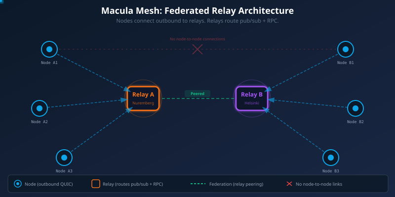

<!-- Render with: npx @marp-team/marp-cli SLIDES.md -o slides.html --html -->

# The Macula
# Federated Relay Mesh

**Infrastructure that survives anything.**


macula.io — April 2026

---

# The Problem

Your applications depend on infrastructure **you don't control**.

```
Your App → AWS us-east-1 → ☠️ → Your users are offline
```

- **AWS** Oct 2025: DynamoDB DNS race condition — **15 hours**, 141 services down, 17M reports
- **Azure** Oct 2025: networking config change — **50 hours**, took down Xbox, Costco, Starbucks
- **Google Cloud** Jun 2025: null-pointer crash loop — **7 hours**, Gmail/Docs/Drive/Maps all down
- **Forrester predicts** at least two major multi-day cloud outages in 2026

100+ outages across AWS, Azure, and Google Cloud in the last 12 months alone.

---

# What If Infrastructure Was Everywhere?



---

# How It Works — MFRM

**Macula Federated Relay Mesh** — stateless QUIC routers, disposable by design.

- **Virtual relay identities** — each city gets its own relay with a unique IPv6 address
- **Nodes connect outbound** to the nearest relay — one QUIC connection
- **If a relay dies**, nodes reroute to another in seconds — automatically
- **Full mesh peering** — relays peer with each other via Bloom filter forwarding

<div style="text-align:center;margin-top:1em;color:#34d399;font-size:1.1em;">
3 physical boxes → <strong>200+ virtual relay identities</strong> across 30+ countries.<br/>
Each relay is a <strong>4 EUR/month VPS</strong>. A data center is a <strong>200M EUR facility</strong>.
</div>

---

# Per-Identity IPv6

Every virtual relay has its own IPv6 address and QUIC listener.

```
relay-de-munich.macula.io    → [2a01:4f8:1c1f:8ab8::142]:4433
relay-fi-helsinki.macula.io  → [2a01:4f9:c014:4259::120]:4433
relay-fr-paris.macula.io    → [2600:3c1a:e001:19::100]:4433
```

Nodes connect to the **identity**, not the box.
DNS resolves to per-identity IPv6 → dedicated QUIC listener.
Box is invisible. Identity is what matters.

---

# Geographic Discovery

Nodes connect to the **nearest virtual relay identity** by city.

```
Node in Munich → relay-de-munich.macula.io (4ms)
                 relay-at-vienna.macula.io  (12ms)  ← failover
                 relay-ch-zurich.macula.io  (18ms)  ← failover
```

On failover: next nearest identity, not round-robin.
Relay health monitored every 30s — stale relays deprioritized.

---

# Event-Driven Presence

Relays **announce themselves** via heartbeat events every 60 seconds.

```
_mesh.relay.up → { hostname: "relay-de-munich.macula.io",
                   identity: { city: "Munich", lat: 48.14, lng: 11.58 }}
```

No heartbeat within 90 seconds → relay **disappears from the mesh**.
No static config. No ghost entries. If it's on the map, it's alive.

---

# Let's See It Live

<!-- Presenter: open macula.io/topology -->

**200+ relays** across 30+ countries — three physical boxes.
**10,000 nodes** connected via per-identity IPv6.
**Real infrastructure**, running right now.

Total relay infrastructure cost: **~30 EUR/month**.

---

# Now Let's Break It

<!-- Presenter: trigger scenario via admin API -->

## Operation Blackout

What happens when entire data centers go offline?

- Nuremberg DC: 100 relays — **gone**
- Helsinki DC: 100 relays — **gone**
- Random infrastructure failures across Europe

**Watch the map. Watch the nodes.**

---

# What Just Happened?

| | MFRM | Centralized Cloud |
|-----|------------|------------------|
| **Relays destroyed** | 100+ | — |
| **Cost of damage** | ~500 EUR (relay VPSes) | 80M+ EUR (DC downtime) |
| **Nodes offline** | 0 (auto-rerouted) | Millions |
| **Recovery time** | 5-7 seconds (automatic) | Hours to days |
| **Human intervention** | None | War rooms, on-call, postmortems |

---

# The Secret: Stateless Relays

**Relays hold no state.** They're routers, not databases.

When a relay dies:
1. Node detects disconnect — **instant** (QUIC timeout)
2. Node connects to next nearest identity — **milliseconds**
3. Node replays subscriptions — **seconds**
4. **Zero data loss. Zero downtime.**

The state lives on the nodes, not the infrastructure.

---

# Erlang Distribution Over the Mesh

Standard Erlang distribution primitives work **transparently** over MFRM.

```erlang
%% Alice in Munich, Bob in Copenhagen — different relays
net_adm:ping('bob@127.0.0.1').              %% pong (via relay mesh)
rpc:call('bob@127.0.0.1', erlang, node, []). %% 'bob@127.0.0.1'
gen_server:call({server, 'bob@127.0.0.1'}, ping). %% {pong, ...}
pg:get_members(pg, lobby).                  %% [<alice>, <bob>]
```

`-proto_dist macula` — one flag. Everything else is standard OTP.

---

# Inter-Relay Ping

Virtual relays ping each other every 30 seconds.

```
relay-de-munich ←→ relay-fi-helsinki     38ms (cross-box, QUIC)
relay-de-munich ←→ relay-at-vienna      <1ms (same box, gen_server)
relay-de-munich ←→ relay-cz-prague      <1ms (same box, gen_server)
```

Local identities: sub-millisecond (same BEAM VM).
Cross-box: real network RTT through QUIC peering.

Results published as `_mesh.relay.ping` for real-time monitoring.

---

# Message Traceroute

Every message can carry an **opt-in trace** — recording each relay hop.

```erlang
macula:publish(Client, <<"weather.de.berlin">>, Data, #{trace => true}).

%% Subscriber receives:
#{topic => <<"weather.de.berlin">>,
  payload => #{temp => 18.2, ...},
  '_trace' => [
    #{relay => <<"relay-de-nuremberg">>, ts => 1712570000123, dir => <<"fwd">>},
    #{relay => <<"relay-fi-helsinki">>,  ts => 1712570000156, dir => <<"fwd">>}
  ]}
```

Full path visibility. Zero overhead when not tracing.

---

# Mesh vs Centralized — The Math

| | Relay Identity | Data Center |
|--|-------|------------|
| **Cost** | 4-8 EUR/month VPS *or* 80 EUR Raspberry Pi | 200M EUR build + 50M EUR/year ops |
| **Deploy** | `docker compose up` + assign IPv6 | 18-24 months construction |
| **Replace** | 5 minutes | Years |
| **Blast radius** | 1 city, 1 identity | Millions of users, entire regions |
| **Recovery** | Automatic, seconds | Manual, hours to days |

**You can't make data centers indestructible.**
**You can make relays disposable.**

---

# Anyone Can Run a Relay

**On a VPS** (4-8 EUR/month):
1. Sign in with GitHub → enter your VPS IP and city
2. DNS created automatically: `relay-XX-yourcity.macula.io`
3. IPv6 assigned, QUIC listener bound, peering automatic
4. `docker compose up -d` — done.

**On a Raspberry Pi / old laptop** (~80 EUR one-time):
1. Install Docker → same compose file
2. Port-forward UDP 4433 (or use IPv6 — no NAT needed)
3. Your living room is now part of the mesh.

---

# The Stack

| Layer | Technology |
|-------|-----------|
| **Transport** | HTTP/3 (QUIC) — UDP, NAT-friendly, 0-RTT reconnect |
| **Identity** | Per-relay IPv6, geographic Kleinberg overlay |
| **Routing** | Full mesh peering, Bloom filter forwarding |
| **Security** | TLS 1.3, AES-256-GCM per-hop |
| **Health** | SWIM protocol + 60s heartbeat + 90s TTL |
| **Peering** | DHT for RPC routing, Kademlia for name resolution |
| **Runtime** | Erlang/OTP 27, 2M concurrent processes per node |

Open source. Apache-2.0. Published on hex.pm.

---

# What Can You Build On This?

- **Chat and messaging** — messages route through the mesh, survive relay failures
- **IoT and edge** — devices connect to nearest relay, failover built in
- **Distributed AI** — LLM inference across the mesh, capability advertisement
- **Supply chain** — event-sourced logistics across organizations and borders
- **Gaming** — real-time multiplayer without dedicated servers (MPong!)

If it needs a network, it runs on the mesh.

---

# Get Involved

**Run a relay** — macula.io/relay
**Install a node** — macula.io/install
**Read the code** — github.com/macula-io/macula
**Support the work** — github.com/sponsors/rgfaber

The mesh grows with every relay, every node, every country.

---

# Questions?


**macula.io**

*"Infrastructure that's too cheap to protect, too distributed to destroy."*

---
