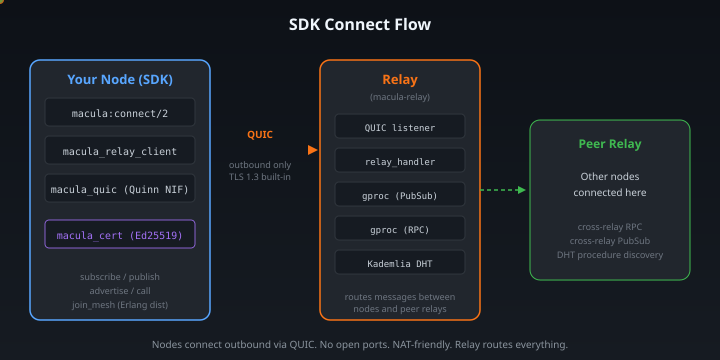
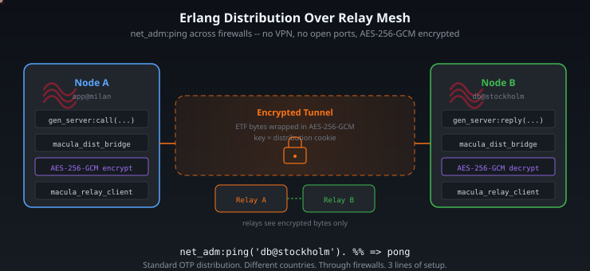

<!-- Render: npx @marp-team/marp-cli SLIDES.md -o slides.html --allow-local-files -->

# Erlang Distribution Through a Relay Mesh

**net_adm:ping across firewalls, NATs, and continents**

macula v1.0 — April 2026


---

## The Problem

Erlang distribution assumes **mutual reachability**.

```
Node A ◄──── TCP (port 4369+) ────► Node B
```

Behind NATs, firewalls, across cloud providers, on edge devices?

**It doesn't work.** Both sides need open ports and routable IPs.

What if nodes only needed **outbound** connectivity?

---

## The Solution: Relay Mesh



Both nodes connect **out** to a relay over QUIC.
No inbound ports. No VPNs. No tunnels to manage.

---

## How It Works: gen_tcp Loopback Bridge



---

## The Trick: Packet Framing

<div class="columns">
<div>

**Handshake phase:**
`{packet, 2}` — 2-byte length prefix

**Post-handshake:**
`{packet, 4}` — 4-byte length prefix

**Bridge socket:**
`{packet, raw}` — doesn't care!

Forwards raw bytes including headers.
Framing is dist_util's job, not ours.

</div>
<div>

```
dist_util (OTP)
    │
DistSock {packet, 2→4}
    │ loopback pair
BridgeSock {packet, raw}
    │
reader ──► relay pub/sub
writer ◄── relay pub/sub
```

OTP gets a **real file descriptor**.
The bridge is a transparent byte pipe.

</div>
</div>

---

## 5 Bugs That Taught Me OTP Internals

| # | Bug | Lesson |
|---|-----|--------|
| 1 | `binary_to_list` | dist_util matches `[$N \| _]` — expects charlists |
| 2 | `getstat` return | Must return `{ok, R, W, P}` 4-tuple, not `{ok, proplist}` |
| 3 | `kernel_pid = self()` | Must be net_kernel PID — deadlocks otherwise |
| 4 | `{packet,2}` on bridge | Bridge can't decode when dist switches to `{packet,4}` |
| 5 | gen_tcp vs QUIC | QUIC needs `handoff_done`; gen_tcp doesn't |

Each one: silent failure, no error message, hours of debugging.

---

## Live Demo: Interactive Mesh Chat

Four terminals. Four relays. Four countries. One mesh.

```
Terminal 1 (Alice)    Terminal 2 (Bob)     Terminal 3 (Chris)   Terminal 4 (Diana)
──────────────────    ─────────────────    ──────────────────   ──────────────────
relay-cz-prague    relay-dk-copenhagen    relay-nl-amsterdam       relay-de-munich
    (Czech Republic)            (Denmark)            (Netherlands)             (Germany)
```

No node can reach any other directly.
All connect **outbound** to their local relay.

---

<!-- _class: "" -->

## Demo: Alice Joins (Terminal 1)

```erlang
$ MACULA_DIST_MODE=relay ERL_FLAGS="-proto_dist macula -no_epmd" \
  rebar3 shell --name alice@127.0.0.1 --setcookie DEMO

1> mesh_chat:connect("relay-cz-prague.macula.io").
[chat] Connecting to relay-cz-prague.macula.io...
[chat] Connected! Node: 'alice@127.0.0.1'
[chat] Ready!
ok

2> mesh_chat:join("lobby").
[chat] Joined #lobby
```

Alice connected to Nuremberg relay. Joined the lobby.

---

<!-- _class: "" -->

## Demo: Bob Joins (Terminal 2)

```erlang
$ MACULA_DIST_MODE=relay ERL_FLAGS="-proto_dist macula -no_epmd" \
  rebar3 shell --name bob@127.0.0.1 --setcookie DEMO

1> mesh_chat:connect("relay-dk-copenhagen.macula.io").
[chat] Connecting to relay-dk-copenhagen.macula.io...
[chat] Connected! Node: 'bob@127.0.0.1'
[chat] Ready!
ok

2> mesh_chat:join("lobby").
[chat] Joined #lobby

3> net_adm:ping('alice@127.0.0.1').
pong
```

Bob connects to Helsinki. Joins lobby. Pings Alice through the mesh. **pong.**

---

<!-- _class: "" -->

## Demo: Chris Joins (Terminal 3 — Paris)

```erlang
$ MACULA_DIST_MODE=relay ERL_FLAGS="-proto_dist macula -no_epmd" \
  rebar3 shell --name chris@127.0.0.1 --setcookie DEMO

1> mesh_chat:connect("relay-nl-amsterdam.macula.io").
[chat] Connected! Node: 'chris@127.0.0.1'

2> mesh_chat:join("lobby").
[chat] Joined #lobby

3> mesh_chat:who("lobby").
[chat] #lobby — 3 member(s):
  ● alice
  ● bob
  ● chris
```

Three nodes, three relays, three countries. One lobby.

---

<!-- _class: "" -->

## Demo: Diana Joins (Terminal 4 — Naples)

```erlang
$ MACULA_DIST_MODE=relay ERL_FLAGS="-proto_dist macula -no_epmd" \
  rebar3 shell --name diana@127.0.0.1 --setcookie DEMO

1> mesh_chat:connect("relay-de-munich.macula.io").
[chat] Connected! Node: 'diana@127.0.0.1'

2> mesh_chat:join("lobby").
[chat] Joined #lobby

3> mesh_chat:join("italian").
[chat] Joined #italian

4> mesh_chat:rooms().
[chat] 2 room(s):
  # italian (1 member)
  # lobby (4 members)
```

Diana is in two rooms. Four nodes across four relays in four countries.

---

<!-- _class: "" -->

## Demo: Ping!

```erlang
%% Alice pings Diana (Germany → Italy):
4> mesh_chat:ping('diana@127.0.0.1').
[ping] Pinging diana...

  ● alice  via relay-cz-prague.macula.io
  │ tunnel (encrypted)
  │   ⋮  relay mesh
  │ tunnel (encrypted)
  ● diana  via relay-de-munich.macula.io

  RTT: 23.4ms

%% Bob pings Alice (same relay? different relay?):
4> mesh_chat:ping('alice@127.0.0.1').
[ping] Pinging alice...

  ● bob    via relay-dk-copenhagen.macula.io
  │ tunnel (encrypted)
  │   ⋮  relay mesh
  │ tunnel (encrypted)
  ● alice  via relay-cz-prague.macula.io

  RTT: 18.7ms
```

Real RTT. Real relay endpoints. The path through the mesh is encrypted — we don't pretend to see it.

---

<!-- _class: "" -->

## Demo: Chat!

```erlang
%% Alice says hello — all 4 terminals see it:
3> mesh_chat:say("lobby", "Hello from Germany!").
[alice/#lobby] Hello from Germany!

%% Chris replies from Paris:
5> mesh_chat:say("lobby", "Salut from France!").
[chris/#lobby] Salut from France!

%% Diana whispers to Chris (only Chris sees it):
5> mesh_chat:whisper('chris@127.0.0.1', "Ciao, ci vediamo dopo").
[diana → chris] Ciao, ci vediamo dopo

%% Diana says something in the italian room (only she is in it):
6> mesh_chat:say("italian", "Nessuno qui ancora...").
[diana/#italian] Nessuno qui ancora...

%% Chris joins italian too:
6> mesh_chat:join("italian").
[chat] Joined #italian
7> mesh_chat:say("italian", "Je suis ici!").
[chris/#italian] Je suis ici!
```

---

## What Just Happened

```
Alice                  Relay (Nuremberg)    Relay (Helsinki)       Bob
  │                        │                     │                  │
  ├─ QUIC connect ────────►│                     │◄──── QUIC ──────┤
  │                        │◄═══ peering DHT ═══►│                  │
  │                        │                     │                  │
  ├─ RPC: tunnel ─────────►├─── DHT lookup ─────►├── tunnel req ──►│
  │◄─ tunnel_id ───────────┤◄────────────────────┤◄── tunnel ack ──┤
  │                        │                     │                  │
  ├── dist handshake bytes ►├─────────────────────►├────────────────►│
  │◄── dist handshake bytes ┤◄─────────────────────┤◄────────────────┤
  │                        │                     │                  │
  │◄══════════ OTP Distribution Connected ══════════════════════════►│
  │                        │                     │                  │
  ├── pg:join / say() ─────►├─────────────────────►├── message ─────►│
```

Standard OTP distribution. AES-256-GCM encrypted. Relay sees only ciphertext.

---

## Everything Works

```erlang
net_adm:ping('bob@127.0.0.1').            %% → pong
gen_server:call({Name, 'bob@...'}, Req).   %% works
Pid ! Message.                             %% works
pg:join(pg, Group, self()).                %% works
monitor(process, {Name, 'bob@...'}).       %% works
rpc:call('bob@...', Module, Fun, Args).    %% works
```

Tick keepalive flows through the bridge. 0 errors after 72h soak test.
Tunnel encrypted with AES-256-GCM — key derived from distribution cookie.

---

## The Code

<div class="columns">
<div>

**macula SDK** (hex.pm)
- `macula_dist.erl` — carrier interface (533 lines)
- `macula_dist_bridge.erl` — relay bridge (252 lines)
- `macula_dist_relay.erl` — tunnel setup
- 39 tests

</div>
<div>

**3 lines to enable:**

```erlang
macula:join_mesh(#{
    relays => [<<"https://...">>],
    realm => <<"io.macula">>
}).
%% That's it. net_adm:ping works now.
```

Or use `mesh_chat:connect/1` for the demo.

</div>
</div>

---

## What's Next

- **Multi-relay failover** — node connected to N relays simultaneously
- **RTT-based relay selection** — nearest relay via geographic + ping measurement
- **Store-and-forward** — offline nodes catch up via event replay
- **E2EE tunnels** — endpoint encryption beyond the relay layer

The mesh already has 303 relays across 35 European countries,
10,000+ stub nodes, and 3 physical relay boxes.

---

## Thank You

**Erlang distribution doesn't need direct connectivity anymore.**

Outbound QUIC to a relay. That's all.

<div class="columns">
<div>

**Code:** github.com/macula-io/macula
**Package:** hex.pm/macula
**Demo:** github.com/macula-io/macula-demo

</div>
<div>


(c) 2020-2026 BEAM Campus
Apache-2.0

</div>
</div>
